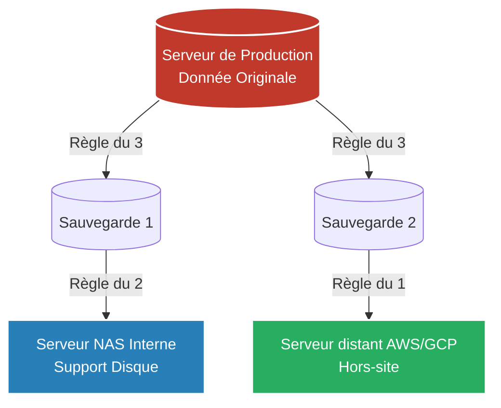

# Sauvegardes et PRA

!!! quote "Se préparer au pire"
    _En informatique, la question n'est pas de savoir **si** votre serveur principal va tomber en panne, mais **quand** il va tomber en panne (ou être détruit par un incendie, ou chiffré par un pirate). La pérennité d'une infrastructure ne se mesure pas à sa capacité à ne jamais tomber, mais à la vitesse et à la fiabilité avec laquelle elle peut **se relever**. C'est l'objectif des Sauvegardes et du PRA._

## 1. La Règle d'Or : Le 3-2-1

C'est le mantra universel de tout administrateur système. Une stratégie de sauvegarde n'est considérée comme fiable que si elle respecte la règle **3-2-1** :

- **3** : Posséder **trois copies** de vos données (L'originale de production + 2 copies de sauvegarde).
- **2** : Stocker ces copies sur **deux supports de stockage différents** (ex: Un NAS sur le réseau local ET des bandes magnétiques LTO).
- **1** : Garder **une copie hors-site** (Dans un autre bâtiment, ou dans le Cloud). Si votre bâtiment brûle (comme le datacenter OVH en 2021), vos sauvegardes locales fondent avec le serveur de production.

---

## 2. RTO et RPO (Le contrat de reprise)

Quand vous définissez la politique de sauvegarde pour une entreprise, la Direction vous imposera deux métriques contractuelles fondamentales :

### Le RPO (Recovery Point Objective) : "Combien de données peut-on perdre ?"
Si vous sauvegardez le serveur toutes les nuits à 00h00, et que le serveur explose à 16h00.
Vous perdrez **16 heures de travail**. Votre RPO est donc de 24h (le temps maximum entre deux sauvegardes). 
*(Pour une banque, le RPO exigé est de l'ordre de la seconde, nécessitant une réplication synchrone et non une sauvegarde nocturne).*

### Le RTO (Recovery Time Objective) : "Combien de temps l'entreprise est-elle paralysée ?"
Le serveur a explosé à 16h00. Il faut :
1. Acheter un nouveau serveur (48h).
2. Réinstaller Linux (2h).
3. Télécharger les 500 Go de la sauvegarde distante Cloud (8h).
L'entreprise sera à l'arrêt pendant **58 heures**. Votre RTO est de 58h.

---

## 3. Le PRA (Plan de Reprise d'Activité)

La Sauvegarde est un objet technique (Le fichier zip).
Le **PRA** (Disaster Recovery Plan) est un **document humain et organisationnel**.

C'est un classeur physique (papier) qui explique étape par étape à un ingénieur junior comment reconstruire toute l'informatique de l'entreprise si le bâtiment a été atomisé la nuit précédente.

**Ce que contient un bon PRA :**
- L'ordre de redémarrage des serveurs (Il faut allumer le LDAP et le DNS *avant* le serveur de mails, sinon ce dernier plantera).
- Où se trouvent physiquement les clés de déchiffrement des sauvegardes.
- Les numéros de téléphone d'urgence des fournisseurs (Fournisseur d'accès, Hébergeur).

### Le Test à Blanc (Fire Drill)
**Une sauvegarde qu'on n'a jamais testé de restaurer s'appelle un espoir, pas une sauvegarde.** 
Un PRA doit être testé physiquement au moins une fois par an. L'équipe IT se réunit un samedi, éteint virtuellement la production, et chronomètre le temps nécessaire pour restaurer l'entreprise à partir de zéro, afin de vérifier si le RTO théorique est respecté dans la réalité.