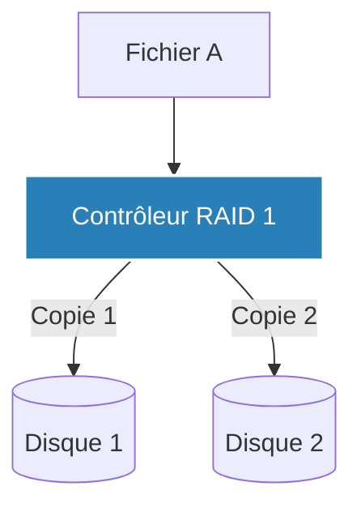

# RAID et File Systems

!!! quote "Gérer le métal et la logique"
    _Avant même de penser aux sauvegardes externes, il faut s'assurer que le serveur lui-même peut survivre à une panne mécanique courante : la mort d'un disque dur. C'est le rôle de la technologie RAID. Ensuite, il faut décider comment le système d'exploitation va formater ce stockage brut pour y ranger des fichiers : c'est le File System._

## 1. La tolérance aux pannes : Le RAID

**RAID** (Redundant Array of Independent Disks) est une technologie qui combine plusieurs disques durs physiques en une seule "grappe" logique. Le but est la tolérance aux pannes et/ou la performance.

Il existe de nombreux niveaux de RAID. En entreprise, trois sont véritablement utilisés :

### RAID 1 (Miroir)
Idéal pour le système d'exploitation (OS).
- **Principe** : Les données sont écrites en double, de manière identique sur deux disques.
- **Tolérance** : Si le Disque A meurt, le serveur continue de fonctionner sur le Disque B sans interruption.
- **Inconvénient** : On perd 50% de l'espace total. (2 disques de 1 To = 1 To utilisable).

### RAID 5 (Parité)
Idéal pour le stockage de données capacitif.
- **Principe** : Nécessite au moins 3 disques. Les données sont "découpées" et réparties sur les disques, avec un bloc mathématique spécial (la Parité).
- **Tolérance** : Si **un seul** disque meurt, le système peut reconstituer mathématiquement les données manquantes grâce à la Parité des autres disques.
- **Avantage** : On ne perd que l'équivalent d'un seul disque (ex: 4 disques de 1 To = 3 To utilisables).

### RAID 10 (Le meilleur des mondes)
Idéal pour les Bases de Données (Haute performance et sécurité).
C'est la combinaison d'un RAID 1 et d'un RAID 0. Il nécessite 4 disques minimum. Il écrit très vite et tolère la perte d'un disque par "sous-grappe". C'est le standard de l'industrie pour les serveurs critiques.

---

## 2. Les Systèmes de Fichiers (File Systems)

Une fois le matériel sécurisé par un RAID, Linux doit "formater" cet espace brut. Le File System dicte comment les dossiers, les fichiers et les permissions sont organisés sur le disque.

### EXT4 (L'historique robuste)
C'est le standard par défaut de 90% des distributions Linux (Ubuntu, Debian).
Il est extrêmement stable, rapide, et supporte la "journalisation" (si le serveur perd l'électricité pendant une écriture, le fichier n'est pas corrompu car l'action était notée dans un journal).

### ZFS (Le titan moderne)
**ZFS** n'est pas juste un File System, c'est aussi un gestionnaire de volumes et un RAID logiciel (ZRAID). Il est de plus en plus utilisé en production (notamment propulsé par Proxmox et TrueNAS).

**Pourquoi ZFS est révolutionnaire (Ops) :**
1. **Intégrité absolue** : ZFS calcule un "hash" (empreinte mathématique) pour chaque bloc de donnée. Il détecte et répare automatiquement la "corruption silencieuse" (Bit Rot).
2. **Snapshots (Instantanés)** : Vous pouvez "prendre en photo" l'état entier de votre serveur en 0.1 seconde, sans espace disque supplémentaire (Copy-on-Write). Si une mise à jour système casse tout, vous restaurez le Snapshot en 0.1 seconde.

## Attention : Le RAID n'est PAS une sauvegarde !

C'est l'erreur de débutant la plus mortelle.
Un étudiant pense : *"J'ai 2 disques en RAID 1 (Miroir), donc si je perds un disque je suis protégé. Je n'ai pas besoin de sauvegarde externe."*

**Faux.**
Le RAID vous protège contre la casse *matérielle*. Mais si vous (ou un virus) supprimez le dossier `/var/www`, le RAID exécutera fidèlement cette commande et supprimera le dossier sur **les deux disques simultanément** à la vitesse de la lumière. Seule une Sauvegarde (Backup) stockée *ailleurs* peut vous sauver d'une erreur logicielle ou humaine.