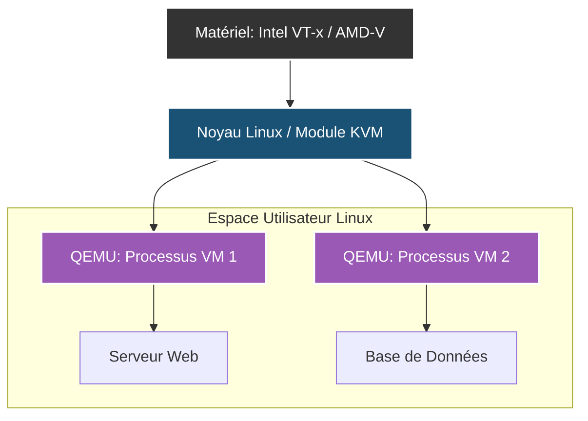

# L'Écosystème KVM / Proxmox

!!! quote "Le noyau Linux devient Hyperviseur"
    _Au lieu de développer un hyperviseur de Type 1 massif et fermé (comme VMware ESXi), la communauté Linux a eu une idée de génie : intégrer directement la capacité de virtualisation dans le noyau Linux. C'est la naissance de **KVM** (Kernel-based Virtual Machine). Grâce à un simple module chargé dans le noyau, chaque machine virtuelle devient un simple processus Linux._

## 1. Comprendre KVM

KVM n'est pas un logiciel que l'on installe comme VirtualBox. C'est une fonctionnalité du "Kernel" Linux.
Lorsqu'il est activé, il permet au noyau d'agir comme un Hyperviseur de Type 1.

**Le flux logique :**
1. Vous installez un serveur Linux normal (ex: Debian).
2. Vous chargez le module KVM (`kvm-intel` ou `kvm-amd`).
3. Le noyau est désormais un hyperviseur Bare-Metal.
4. L'outil `QEMU` vient se brancher dessus pour créer les périphériques virtuels (disque dur, carte réseau).
5. Vous démarrez une Machine Virtuelle (VM). Le système Linux voit cette VM complète comme un simple programme classique (un PID géré par l'ordonnanceur Linux) !

---

## 2. Le besoin d'un chef d'orchestre : Proxmox VE

Gérer KVM à la main, en ligne de commande (avec `virsh` ou des commandes `qemu` interminables), est faisable mais extrêmement fastidieux en production.

Si vous avez 5 serveurs physiques (Nœuds) et 50 machines virtuelles, vous avez besoin d'une interface graphique, de sauvegardes automatisées, de statistiques visuelles, et de migration "à chaud" (déplacer une VM du Serveur A vers le Serveur B sans l'éteindre).

C'est exactement ce que fait **Proxmox Virtual Environment (PVE)**.

### Qu'est-ce que Proxmox ?
Proxmox n'est pas un hyperviseur maison. C'est une distribution Linux (basée sur Debian) qui préinstalle, configure et englobe **KVM**, **LXC** (pour les conteneurs légers), et un puissant système de fichiers (**ZFS** ou Ceph). Le tout est piloté par une magnifique interface Web accessible depuis votre navigateur.

Il est 100% gratuit, Open Source, et concurrence directement la solution payante leader VMware vSphere.

### Les fonctionnalités phares de Proxmox
1. **Haute Disponibilité (HA)** : Si un de vos serveurs physiques (Nœud 1) prend feu, Proxmox relance automatiquement les VMs qui étaient dessus sur le Nœud 2 en quelques secondes.
2. **Sauvegardes intégrées (Proxmox Backup Server)** : Proxmox inclut nativement un outil de sauvegarde incrémentale, chiffrée, avec déduplication (qui fait économiser des térabytes de stockage).
3. **LXC (Linux Containers)** : Outre les "vraies" VMs (KVM), Proxmox gère les conteneurs LXC, qui consomment 10 fois moins de RAM qu'une VM classique pour faire tourner un simple service Linux.

## Conclusion

Dans le monde de l'administration système moderne On-Premise (dans ses propres locaux), **Proxmox VE** est devenu le roi de l'infrastructure Open Source. La première chose qu'un ingénieur système installe sur un nouveau serveur physique n'est plus Ubuntu ou Windows, c'est Proxmox. Ainsi, le serveur "nu" devient une plateforme élastique capable d'accueillir n'importe quel système de manière isolée et supervisée.