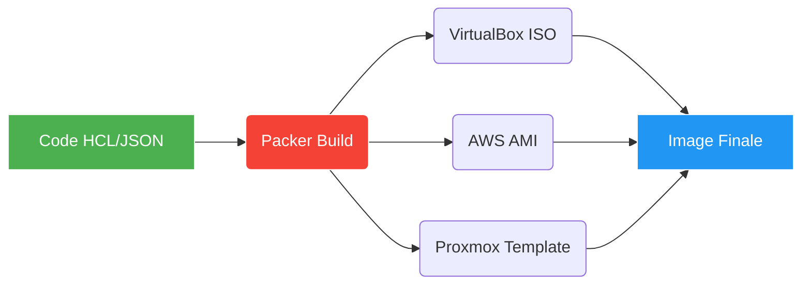

# HashiCorp Packer : Automatisation et Création d'Images

## Introduction à Packer

Packer est un outil open source d'**Image as Code** (IaC) développé par HashiCorp. Il permet de construire des images machines (VM, conteneurs, images Cloud) identiques et reproductibles pour de multiples plateformes (VirtualBox, VMware, Proxmox, AWS, Azure, Docker, etc.) **à partir d'un seul fichier de configuration**.

> [!abstract] 💡 Pourquoi utiliser Packer ?
> - **Standardisation** : Toutes vos machines de test ou de production démarrent d'une base strictement identique (Golden Image).
> - **Déploiement rapide** : Plutôt que d'installer un OS et de le configurer à chaque lancement de machine, Packer "pré-cuit" une image complète. La création d'une nouvelle instance ne prend plus que quelques secondes.
> - **Intégration CI/CD** : Packer s'intègre parfaitement aux pipelines automatisés (GitLab CI, GitHub Actions).
> - **Code-driven (HCL)** : L'infrastructure et ses images sont gérées sous forme de code, facilitant le versionnage et la revue de code.

---

## Fonctionnement et Concepts Clés



L'architecture d'un projet Packer repose sur trois composants principaux définis dans les fichiers `.pkr.hcl` :

1. **Sources (Builders)** : *Où et comment l'image va être créée.* (Ex: à partir d'une ISO Ubuntu dans VirtualBox).
2. **Provisioners** : *Ce qui va être installé dans l'image après son installation.* (Ex: Scripts Shell, PowerShell, Ansible).
3. **Post-Processors** : *Ce qu'il faut faire de l'image une fois terminée.* (Ex: La compresser, l'uploader sur le Cloud, la convertir en template Vagrant).

---

## Exemples Pratiques (Builder VirtualBox)

Afin d'illustrer la puissance de Packer dans un environnement de laboratoire standard, nous allons concevoir **3 images depuis zéro** ciblant l'hyperviseur local VirtualBox.

### 1. Image Ubuntu (Server Base)

La création d'une image Linux implique souvent de fournir à l'installateur une configuration de réponse automatique (comme `user-data` pour Cloud-init ou `preseed`).

```hcl title="ubuntu.pkr.hcl"
packer {
  required_plugins {
    virtualbox = {
      version = "~> 1.0"
      source  = "github.com/hashicorp/virtualbox"
    }
  }
}

source "virtualbox-iso" "ubuntu" {
  # Paramètres de la VM
  vm_name              = "ubuntu-22.04-base"
  guest_os_type        = "Ubuntu_64"
  cpus                 = 2
  memory               = 2048
  disk_size            = 20000

  # Source de l'image d'installation
  iso_url              = "https://releases.ubuntu.com/22.04.4/ubuntu-22.04.4-live-server-amd64.iso"
  iso_checksum         = "file:https://releases.ubuntu.com/22.04.4/SHA256SUMS"

  # Identifiants SSH (créés lors de l'installation auto)
  ssh_username         = "omnyadmin"
  ssh_password         = "omnyadmin"
  ssh_timeout          = "20m"

  # Simulation de frappes clavier pour lancer l'autoinstallation (Cloud-init via le serveur web interne Packer)
  http_directory       = "http" # Dossier local contenant le fichier user-data
  boot_command         = [
    "e<down><down><down><end>",
    " autoinstall ds=nocloud-net;s=http://{{ .HTTPIP }}:{{ .HTTPPort }}/",
    "<f10>"
  ]

  # Arrêt sécurisé de la machine
  shutdown_command     = "echo 'omnyadmin' | sudo -S shutdown -P now"
}

build {
  sources = ["source.virtualbox-iso.ubuntu"]

  # Une fois l'OS installé, nous provisionnons avec un script Shell
  provisioner "shell" {
    inline = [
      "sudo apt-get update -y",
      "sudo apt-get upgrade -y",
      "sudo apt-get install -y curl git ufw",
      "echo 'Image Ubuntu Packer générée avec succès!' > /home/omnyadmin/packer-build.txt"
    ]
  }
}
```

> [!tip] 
> Dans ce scénario, Packer monte un petit serveur HTTP local. La commande `boot_command` saisit à toute vitesse dans l'interface de boot de l'ISO Ubuntu l'instruction d'aller chercher la configuration `user-data` sur ce serveur HTTP pour installer l'OS sans aucune interaction humaine.

---

### 2. Image Kali Linux (Sécurité Offensive)

Construire une image orientée cybersécurité (PenTesting).

```hcl title="kali.pkr.hcl"
packer {
  required_plugins {
    virtualbox = {
      version = "~> 1.0"
      source  = "github.com/hashicorp/virtualbox"
    }
  }
}

source "virtualbox-iso" "kali" {
  vm_name              = "kali-linux-custom"
  guest_os_type        = "Debian_64"
  cpus                 = 2
  memory               = 4096
  disk_size            = 30000

  iso_url              = "https://cdimage.kali.org/kali-2023.3/kali-linux-2023.3-installer-amd64.iso"
  iso_checksum         = "sha256:..." # Insérer le bon hash

  ssh_username         = "root"
  ssh_password         = "toor"
  ssh_timeout          = "30m"

  http_directory       = "http" # Contient le fichier preseed.cfg pour Kali/Debian
  boot_command         = [
    "<esc><wait>",
    "install ",
    "preseed/url=http://{{ .HTTPIP }}:{{ .HTTPPort }}/preseed.cfg ",
    "debian-installer=en_US auto locale=en_US kbd-chooser/method=us ",
    "netcfg/get_hostname=kali netcfg/get_domain=local ",
    "<enter>"
  ]

  shutdown_command     = "shutdown -h now"
}

build {
  sources = ["source.virtualbox-iso.kali"]

  provisioner "shell" {
    inline = [
      "apt-get update",
      "apt-get install -y nmap metasploit-framework dirb",
      # Suppression du cache APT pour alléger l'image
      "apt-get clean"
    ]
  }
}
```

---

### 3. Image Windows Server (Golden Image)

La création d'images Windows est plus complexe car elle repose sur le composant WinRM (Windows Remote Management) pour la communication Packer -> VM (à la place du classique SSH), et requiert un fichier `autounattend.xml` sur un lecteur virtuel de disquette (`floppy`) pour automatiser l'installation.

```hcl title="windows.pkr.hcl"
packer {
  required_plugins {
    virtualbox = {
      version = "~> 1.0"
      source  = "github.com/hashicorp/virtualbox"
    }
  }
}

source "virtualbox-iso" "windows" {
  vm_name              = "win-server-2022"
  guest_os_type        = "Windows2019_64" # VBox utilise cette nomenclature pour Srv2022
  cpus                 = 2
  memory               = 4096
  disk_size            = 50000

  iso_url              = "C:/ISO/Windows_Server_2022.iso" # Peut être un chemin local
  iso_checksum         = "none" # Uniquement en dev local

  # Remplacement du SSH par WinRM (Activé dans le script autounattend.xml)
  communicator         = "winrm"
  winrm_username       = "Administrator"
  winrm_password       = "Password123!"
  winrm_timeout        = "45m"
  winrm_insecure       = true
  winrm_use_ssl        = false

  # Le lecteur de disquette attache les fichiers de réponse Windows
  floppy_files         = [
    "setup/autounattend.xml",
    "scripts/enable-winrm.ps1"
  ]

  shutdown_command     = "shutdown /s /t 10 /f /d p:4:1 /c \"Packer Shutdown\""
}

build {
  sources = ["source.virtualbox-iso.windows"]

  # Provisionnement via PowerShell plutôt que Shell Unix
  provisioner "powershell" {
    inline = [
      "Write-Host 'Installation des utilitaires sysadmin...'",
      "Install-PackageProvider -Name NuGet -MinimumVersion 2.8.5.201 -Force",
      "Set-PSRepository -Name 'PSGallery' -InstallationPolicy Trusted",
      "Install-Module -Name 'PSWindowsUpdate' -Force",
      "Write-Host 'Image Windows configurée avec succès.'"
    ]
  }

  # Exécution d'un script Windows Update classique pour patcher la Golden Image
  provisioner "windows-update" {
    search_criteria = "IsInstalled=0"
    filters = [
      "exclude:$_.Title -like '*VMware*'",
      "exclude:$_.Title -like '*Preview*'",
      "include:$true"
    ]
  }
}
```

> [!important]
> Pour que Packer réussisse à configurer une image Windows, le fichier `autounattend.xml` (fourni dans le `floppy_files`) doit impérativement configurer le compte Administrateur, désactiver l'UAC pour ce compte, et lancer un script d'activation de WinRM au premier démarrage (FirstLogonCommands) afin que Packer puisse prendre la main sur la VM après l'installation OS.

---

## Conclusion et Déploiement

Une fois le fichier `.pkr.hcl` rédigé, sa génération s'effectue en deux commandes universelles :

1. `packer init .` (Télécharge les plugins nécessaires, comme le module virtualbox).
2. `packer build ubuntu.pkr.hcl` (Lance le processus de A à Z et génère la machine virtuelle éteinte et configurée).

En combinant Packer avec un outil d'Infrastructure as Code (IaC) comme **Terraform**, vous obtiendrez la synergie parfaite : Packer crée les briques (Images) et Terraform construit le mur (déploie les machines virtuelles à partir de ces images sur un hyperviseur).
