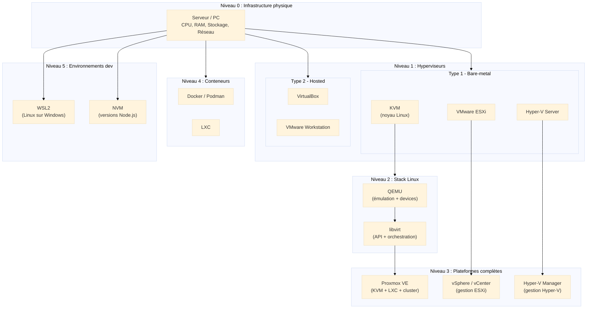

# Panorama de la Virtualisation

<div
  class="omny-meta"
  data-level="🟢 Débutant & 🟡 Intermédiaire"
  data-version="1.0"
  data-time="25-35 minutes">
</div>

## Introduction : Pourquoi ce panorama ?

!!! quote "Analogie pédagogique"
    _Imaginez que vous devez **traverser une grande ville inconnue** : avant de vous lancer dans les ruelles, vous consultez d'abord un **plan général** pour comprendre où se trouvent les quartiers, les axes principaux, les zones à éviter. **Ce panorama fonctionne exactement ainsi** : c'est la carte mentale complète de la virtualisation qui vous permet de situer chaque technologie (VirtualBox, VMware, QEMU/KVM, Proxmox, WSL, Docker, NVM) dans son contexte, de comprendre ce qu'elle remplace, ce qu'elle permet, et surtout ce qu'elle ne fait pas._

Dans l'écosystème de la virtualisation, il existe **des dizaines de technologies** qui semblent toutes faire "à peu près la même chose" : isoler des environnements, exécuter plusieurs systèmes sur une même machine, tester des configurations. Mais dans la réalité, **chaque outil occupe une niche précise** et répond à des besoins différents.

Ce panorama n'est **pas un guide d'installation** ni une documentation technique exhaustive. C'est une **boussole conceptuelle** qui répond à trois questions fondamentales :

1. **Quelle technologie pour quel usage ?** (développement, production, lab cybersécurité, test)
2. **Qu'est-ce que chaque outil remplace concrètement ?** (dual boot, serveur physique, VM de test)
3. **Quelles sont les limites de chaque approche ?** (scalabilité, isolation, performance)

!!! info "Objectif pédagogique"
    À la fin de cette lecture, vous saurez **exactement où se situe chaque technologie** dans le paysage global, et vous comprendrez **pourquoi** on utilise QEMU/KVM pour de la prod Linux, VirtualBox pour du test de bureau, WSL pour du dev Windows, ou Docker pour des microservices.

---

## Pour repartir des bases

Si vous découvrez la virtualisation, trois concepts fondamentaux à retenir :

### 1. Virtualisation ≠ Émulation ≠ Conteneurisation

Ces trois termes sont souvent confondus, mais représentent des approches radicalement différentes :

=== "Virtualisation complète"

    _Simule un ordinateur complet avec son propre noyau, sa mémoire isolée, ses périphériques virtuels._ 

    !!! example "Exemples : **VirtualBox**, **VMware**, **QEMU/KVM**."

    ```mermaid
    ---
    config:
      theme: "base"
    ---
    graph TB
      subgraph VIRTUALISATION["Virtualisation complète"]
        V1["OS invité complet<br/>Noyau séparé<br/>Périphériques virtuels"]
      end
    ```

=== "Émulation"

    _Traduit les instructions d'une architecture CPU vers une autre (ARM → x86). Très flexible mais lent._

    !!! example "Exemple : **QEMU** en mode TCG."

    ```mermaid
    ---
    config:
      theme: "base"
    ---
    graph TB
      subgraph EMULATION["Émulation"]
        E1["Traduction d'architecture<br/>ARM → x86<br/>Très flexible, lent"]
      end
    ```

=== "Conteneurisation"

    _Isole des processus en partageant le noyau de l'hôte. Léger et rapide mais limité à la même architecture._

    !!! example "Exemples : **Docker**, **LXC**."

    ```mermaid
    ---
    config:
      theme: "base"
    ---
    graph TB
      subgraph CONTAINERS["Conteneurisation"]
        C1["Partage du noyau hôte<br/>Isolation processus<br/>Léger et rapide"]
      end
    ```

### 2. Type 1 vs Type 2

La classification historique des hyperviseurs repose sur **où s'exécute l'hyperviseur** :

=== "Type 1 (Bare-metal)"

    **Type 1 (Bare-metal)** :
    _L'hyperviseur s'installe directement sur le matériel, sans OS intermédiaire. Performances maximales, usage production._

    | Exemples | Caractéristiques |
    |----------|-----------------|
    | VMware ESXi | Leader entreprise, écosystème mature |
    | Hyper-V Server | Intégration Microsoft native |
    | KVM (+ QEMU) | Open-source, intégré au noyau Linux |
    | Xen | Historique, utilisé par AWS |

    ```mermaid
    ---
    config:
      theme: "base"
    ---
    graph TB
        subgraph TYPE1["Type 1 : Bare-metal"]
            HW1["Matériel physique<br/>(CPU, RAM, stockage)"]
            HV1["Hyperviseur<br/>(ESXi, Hyper-V, KVM)"]
            VM1["VMs invitées<br/>(Linux, Windows, BSD...)"]
            HW1 --> HV1 --> VM1
        end
    ```

=== "Type 2 (Hosted)"

    **Type 2 (Hosted)** :
    _L'hyperviseur fonctionne comme une application sur un OS existant (Windows, macOS, Linux). Simple d'usage, performances moindres._

    | Exemples | Caractéristiques |
    |----------|-----------------|
    | VirtualBox | Gratuit, multi-plateforme, pédagogique |
    | VMware Workstation | Payant, puissant, compatible ESXi |
    | Parallels Desktop | macOS, optimisé pour Windows sur Mac |

    ```mermaid
    ---
    config:
      theme: "base"
    ---
    graph TB
        subgraph TYPE2["Type 2 : Hosted"]
            HW2["Matériel physique"]
            OS2["OS hôte<br/>(Windows, macOS, Linux)"]
            HV2["Hyperviseur<br/>(VirtualBox, Workstation)"]
            VM2["VMs invitées"]
            HW2 --> OS2 --> HV2 --> VM2
        end
    ```

### 3. Pourquoi virtualiser ? Les cas d'usage réels

Avant de choisir une technologie, il faut comprendre **le problème à résoudre** :

| Besoin | Solution adaptée | Pourquoi |
|--------|-----------------|----------|
| Tester une distribution Linux | VirtualBox, VMware Workstation | Simple, rapide, jetable |
| Lab de cybersécurité | QEMU/KVM + snapshots | Isolation forte, reproductibilité |
| Prod serveur Linux | QEMU/KVM + Proxmox | Performances, cluster, HA |
| Dev Windows + outils Linux | WSL2 | Intégration native, pas de double boot |
| Microservices scalables | Docker + Kubernetes | Légèreté, orchestration |
| Tests multi-versions Node | NVM | Pas de VM nécessaire, switch instantané |

---

## La carte mentale globale

Voici une représentation complète de l'écosystème en une seule vue :



_Cette carte montre **tous les niveaux de l'écosystème** : du matériel physique aux outils de développement, en passant par les hyperviseurs, la stack Linux et les plateformes de production._

---

## Les hyperviseurs de bureau (Type 2)

=== "VirtualBox (Oracle)"

    ### VirtualBox (Oracle)

    **Positionnement** : Solution **gratuite et pédagogique** pour tester des OS sur un poste de travail.

    <div class="grid cards" markdown>

    - **Points forts**

        ---

        - **Multi-plateforme** : Windows, macOS, Linux
        - **Interface graphique intuitive** pour débutants
        - **Snapshots** : retour en arrière instantané
        - **Export OVA** : portabilité des VMs
        - **Gratuit** pour usage personnel et éducatif

    - **Points faibles**

        ---

        - Performances limitées (overhead Type 2)
        - Pas de cluster, HA, ou gestion centralisée
        - Réseau avancé complexe (NAT, bridge, host-only)
        - Pas adapté à la production serveur

    </div>

    <div class="grid cards" markdown>

    - **Ce que VirtualBox remplace**

        ---

        - Le **dual boot** Windows/Linux
        - L'achat d'un second PC pour tester
        - La peur de "casser" sa machine en testant

    - **Ce que VirtualBox ne remplace pas**

        ---

        - Un hyperviseur de production (ESXi, KVM)
        - Une solution de cluster ou haute disponibilité
        - Des performances bare-metal

    </div>

    <div class="grid cards" markdown>

    - **Cas d'usage typiques**

        ---

        - Formation et certification (LPIC, RHCSA, CCNA labs)
        - Tests de distribution Linux avant installation
        - Développement multi-OS (tester sur Windows et Linux)
        - Démos commerciales avec VMs pré-packagées

    </div>

=== "VMware Workstation / Player"

    ### VMware Workstation / Player

    **Positionnement** : Hyperviseur Type 2 **professionnel** avec compatibilité ESXi.

    <div class="grid cards" markdown>

    - **Points forts**

        ---

        - **Performances supérieures** à VirtualBox
        - **Compatibilité ascendante** avec ESXi (export/import)
        - **Réseau virtuel avancé** (topologies complexes)
        - **Support USB 3.0, audio, 3D**
        - **Snapshots et clones liés**

    - **Points faibles**

        ---

        - **Payant** (Workstation Pro)
        - Limité à l'usage poste de travail
        - Pas de gestion centralisée (pas de vCenter)

    </div>

    <div class="grid cards" markdown>

    - **Ce que Workstation remplace**

        ---

        - VirtualBox pour des usages pros
        - Des labs ESXi complets pour tests VMware
        - La nécessité de monter un serveur pour 3-4 VMs

    </div>

    <div class="grid cards" markdown>

    - **Cas d'usage typiques**

        ---

        - Formation VMware (VCP, VCAP)
        - Labs réseau Cisco/Juniper complexes
        - Environnements de test pré-prod
        - Développement avec contraintes VMware

    </div>

---

## Les hyperviseurs de production (Type 1)

=== "VMware ESXi / vSphere - (Payant)"

    ### VMware ESXi / vSphere

    **Positionnement** : **Référence historique** de la virtualisation datacenter.

    **Architecture** :

    ```mermaid
    ---
    config:
      theme: "base"
    ---
    graph TB
        subgraph INFRA["Infrastructure VMware"]
            direction TB
            VCENTER["vCenter Server<br/>(orchestration centrale)"]
            
            subgraph CLUSTER["Cluster ESXi"]
                ESX1["ESXi Host 1"]
                ESX2["ESXi Host 2"]
                ESX3["ESXi Host 3"]
            end
            
            STORAGE["Stockage partagé<br/>(SAN, NFS, vSAN)"]
            NETWORK["Réseau<br/>(vSwitch, NSX)"]
        end
        
        VCENTER --> ESX1
        VCENTER --> ESX2
        VCENTER --> ESX3
        ESX1 --> STORAGE
        ESX2 --> STORAGE
        ESX3 --> STORAGE
        ESX1 --> NETWORK
        ESX2 --> NETWORK
        ESX3 --> NETWORK
    ```

    <div class="grid cards" markdown>

    - **Points forts**

        ---

        - **Écosystème mature** (30+ ans d'expertise)
        - **vMotion** : migration à chaud de VMs
        - **DRS** : équilibrage automatique de charge
        - **HA** : redémarrage automatique sur panne
        - **Support entreprise** 24/7

    - **Points faibles**

        ---

        - **Coûts élevés** (licences par socket)
        - **Vendor lock-in** fort
        - **Complexité** (formation nécessaire)

    </div>

    <div class="grid cards" markdown>

    - **Ce que vSphere remplace**

        ---

        - Des dizaines de serveurs physiques sous-exploités
        - Des infrastructures hétérogènes impossibles à gérer
        - Le besoin d'équipes d'administration par site

    </div>

    <div class="grid cards" markdown>

    - **Cas d'usage typiques**

        ---

        - Datacenters d'entreprise (>100 VMs)
        - Consolidation serveur à grande échelle
        - Environnements critiques (banque, santé, industrie)

    </div>

=== "Hyper-V / Hyper-V Server"

    ### Hyper-V / Hyper-V Server

    **Positionnement** : Solution Microsoft **intégrée à Windows Server**.

    <div class="grid cards" markdown>

    - **Points forts**

        ---

        - **Inclus** dans Windows Server (pas de licence séparée)
        - **Intégration AD** native
        - **System Center** pour gestion centralisée
        - **Réplication intégrée** (Hyper-V Replica)

    - **Points faibles**

        ---

        - Écosystème très **Microsoft-centrique**
        - Moins mature que VMware pour hétérogénéité
        - Performance Linux historiquement inférieure (s'améliore)

    </div>

    <div class="grid cards" markdown>

    - **Ce que Hyper-V remplace**

        ---

        - VMware dans des environnements 100% Microsoft
        - Serveurs physiques Windows redondants
        - Terminal Server farms

    </div>

    <div class="grid cards" markdown>

    - **Cas d'usage typiques**

        ---

        - Infrastructure full Microsoft (AD, Exchange, SQL)
        - Environnements Windows Desktop (VDI)
        - PME avec compétences Windows exclusives

    </div>

=== "KVM (Kernel-based Virtual Machine)"

    ### KVM (Kernel-based Virtual Machine)

    **Positionnement** : Hyperviseur **intégré au noyau Linux**, fondation open-source.

    **Architecture KVM + QEMU + libvirt** :

    ```mermaid
    ---
    config:
      theme: "base"
    ---
    graph TB
        subgraph HOST["Hôte Linux"]
            direction TB
            
            subgraph USERSPACE["Espace utilisateur"]
                QEMU["QEMU<br/>(émulation périphériques)"]
                LIBVIRT["libvirt<br/>(API + virsh)"]
            end
            
            subgraph KERNEL["Noyau Linux"]
                KVM["Module KVM<br/>(kvm.ko)"]
                KMOD["kvm_intel / kvm_amd<br/>(support matériel)"]
            end
            
            LIBVIRT --> QEMU
            QEMU --> KVM
            KVM --> KMOD
        end
        
        subgraph VMS["Machines virtuelles"]
            VM1["VM Linux"]
            VM2["VM Windows"]
            VM3["VM BSD"]
        end
        
        QEMU --> VMS
    ```

    <div class="grid cards" markdown>

    - **Points forts**

        ---

        - **Open-source** (GPL) et gratuit
        - **Performances** proches du bare-metal
        - **Flexibilité maximale** (aucun lock-in)
        - **Intégration native** à Linux

    - **Points faibles**

        ---

        - Pas d'interface graphique native (Proxmox, virt-manager requis)
        - Courbe d'apprentissage plus raide
        - Moins de support commercial direct
    
    </div>

    <div class="grid cards" markdown>

    - **Ce que KVM remplace**

        ---

        - ESXi dans un contexte open-source
        - Xen (historique Linux)
        - Des serveurs Linux physiques multiples
    
    </div>

    <div class="grid cards" markdown>

    - **Cas d'usage typiques**

        ---

        - Datacenters Linux (OVH, Scaleway, Hetzner)
        - Cloud providers (OpenStack)
        - Labs de formation Linux
        - Infrastructure DevOps
    
    </div>

---

## Les plateformes de virtualisation complètes

=== "Proxmox VE"

    ### Proxmox VE

    **Positionnement** : **Plateforme open-source complète** basée sur KVM + LXC.

    **Ce que Proxmox apporte au-dessus de KVM** :

    | Fonctionnalité | KVM seul | Proxmox VE |
    |----------------|----------|------------|
    | Interface web | ❌ | ✅ (HTML5, responsive) |
    | Cluster HA | ❌ (scripts manuels) | ✅ (intégré) |
    | Stockage distribué | ❌ | ✅ (Ceph intégré) |
    | Backup/Restore | ❌ | ✅ (planification, compression) |
    | Conteneurs LXC | ❌ | ✅ (intégré) |
    | Migration à chaud | ❌ (virsh manuel) | ✅ (GUI) |

    <div class="grid cards" markdown>

    - **Points forts**

        ---

        - **Gratuit** (support payant optionnel)
        - **Web UI moderne** et intuitive
        - **VMs + conteneurs** dans un seul outil
        - **Cluster natif** (Corosync + PVE)
        - **Backup intégré** (Proxmox Backup Server)

    - **Points faibles**

        ---

        - Nécessite expertise Linux système
        - Documentation parfois inégale
        - Moins de support tiers que VMware
    
    </div>

    <div class="grid cards" markdown>

    - **Ce que Proxmox remplace**

        ---

        - ESXi + vCenter pour PME/ETI budget serré
        - OpenStack (trop complexe pour PME)
        - "Debian + KVM + scripts bash maison"
    
    </div>

    <div class="grid cards" markdown>

    - **Cas d'usage typiques**

        ---

        - Hébergeurs web (OVH, Hetzner)
        - PME/ETI avec budget IT limité
        - Labs de formation cybersécurité
        - Clusters on-premise 3-10 nœuds
    
    </div>

=== "vSphere / vCenter (rappel)"

    ### vSphere / vCenter (rappel)

    **Positionnement** : Suite de **gestion centralisée** pour ESXi.

    <div class="grid cards" markdown>

    - **Composants clés**

        ---

        - **vCenter Server** : orchestration
        - **vMotion** : migration à chaud
        - **DRS** : optimisation ressources
        - **HA** : haute disponibilité
        - **vSAN** : stockage software-defined

    - **Ce que vSphere remplace**

        ---

        - Gestion manuelle de dizaines d'ESXi
        - Scripts PowerCLI artisanaux
        - Besoin d'équipes distribuées par site
    
    </div>

---

## Conteneurs vs Machines Virtuelles

=== "Docker / Podman"

    ### Docker / Podman

    **Positionnement** : **Conteneurisation** d'applications, pas de systèmes complets.

    **Architecture** :

    ```mermaid
    ---
    config:
      theme: "base"
    ---
    graph TB
        subgraph VM["VM classique"]
            direction TB
            HV1["Hyperviseur"]
            OS1["OS invité 1<br/>(noyau complet)"]
            OS2["OS invité 2<br/>(noyau complet)"]
            APP1["Application 1"]
            APP2["Application 2"]
            HV1 --> OS1 --> APP1
            HV1 --> OS2 --> APP2
        end
        
        subgraph CONTAINER["Conteneurs"]
            direction TB
            HOST["OS Hôte<br/>(noyau partagé)"]
            ENGINE["Docker Engine"]
            CONT1["Conteneur 1<br/>(libs + app)"]
            CONT2["Conteneur 2<br/>(libs + app)"]
            HOST --> ENGINE
            ENGINE --> CONT1
            ENGINE --> CONT2
        end
    ```

    **Différences fondamentales** :

    | Critère | VM | Conteneur |
    |---------|-----|-----------|
    | **Noyau** | Séparé par VM | Partagé avec hôte |
    | **Taille** | Plusieurs Go | Quelques Mo |
    | **Boot** | Minutes | Secondes |
    | **Isolation** | Forte (matérielle) | Processus (cgroups, namespaces) |
    | **Portabilité** | Moyenne (image lourde) | Élevée (Dockerfile) |

    <div class="grid cards" markdown>

    - **Ce que Docker remplace**

        ---

        - Une VM par microservice
        - Scripts d'installation applicatifs
        - Dépendances système conflictuelles

    - **Ce que Docker ne remplace pas**

        ---

        - VM pour tester un OS complet
        - Isolation forte (malware, audit sécu)
        - Systèmes avec noyau custom (Windows dans Linux)
    
    </div>

    <div class="grid cards" markdown>

    - **Cas d'usage typiques**

        ---

        - Microservices (API REST, workers)
        - CI/CD (builds reproductibles)
        - Environnements de dev portables
        - Déploiement Kubernetes
        
    </div>

=== "LXC (Linux Containers)"

    ### LXC (Linux Containers)

    **Positionnement** : Conteneurs **système** (vs applicatifs pour Docker).

    <div class="grid cards" markdown>

    - **Différence avec Docker**

        ---

        - **LXC** : conteneur qui ressemble à une VM Linux complète (systemd, SSH, multi-processus)
        - **Docker** : conteneur d'application (un seul processus principal)

    - **Cas d'usage**

        ---

        - Proxmox (alternative légère aux VMs)
        - Hébergement mutualisé (isolation clients)
        - Labs rapides (boot en 2-3 secondes)
    
    </div>

---

## Environnements de développement

=== "WSL2 (Windows Subsystem for Linux)"

    ### WSL2 (Windows Subsystem for Linux)

    **Positionnement** : **VM Linux intégrée à Windows**, optimisée pour développeurs.

    !!! note "Documentation déjà disponible"
        WSL est détaillé dans **Fondamentaux IT → Environnement virtuel → WSL**  
        [Voir la fiche complète](https://omnydocs.netlify.app/bases/outils/environnement-virtuel/wsl/)

    **Architecture WSL2** :

    ```mermaid
    ---
    config:
      theme: "base"
    ---
    graph TB
        subgraph WINDOWS["Windows 11"]
            direction TB
            WSL2["WSL2<br/>(VM Linux légère)"]
            DISTRO1["Ubuntu 22.04"]
            DISTRO2["Debian 12"]
            DISTRO3["Kali Linux"]
            FS["Système de fichiers<br/>intégré (\\wsl$)"]
        end
        
        WSL2 --> DISTRO1
        WSL2 --> DISTRO2
        WSL2 --> DISTRO3
        WSL2 --> FS
    ```

    <div class="grid cards" markdown>

    - **Points forts** :

        - **Intégration Windows native** (pas de double boot)
        - **Performances proches VM** (Hyper-V sous le capot)
        - **Accès aux fichiers Windows** depuis Linux
        - **Docker Desktop** fonctionne via WSL2
    
    </div>

    <div class="grid cards" markdown>

    - **Ce que WSL remplace**

        - Dual boot Windows/Linux
        - VM VirtualBox "Ubuntu pour dev"
        - Git Bash / Cygwin

    - **Ce que WSL ne remplace pas**

        - Hyperviseur de prod (Proxmox, ESXi)
        - Labs cybersécurité multi-VMs
        - Environnements réseau complexes
    
    </div>

    <div class="grid cards" markdown>

    - **Cas d'usage typiques**

        - Dev backend Linux sur poste Windows
        - Scripts Bash / Python / Go
        - Docker sans VM intermédiaire lourde
    
    </div>

=== "NVM (Node Version Manager)"

    ### NVM (Node Version Manager)

    **Positionnement** : **Gestionnaire de versions Node.js**, pas de virtualisation système.

    !!! note "Documentation déjà disponible"
        NVM est détaillé dans **Fondamentaux IT → Environnement virtuel → NVM**  
        [Voir la fiche complète](https://omnydocs.netlify.app/bases/outils/environnement-virtuel/nvm/)

    **Ce que NVM permet** :

    ```bash
    # Installer plusieurs versions Node
    nvm install 16.20.0
    nvm install 18.18.0
    nvm install 20.9.0

    # Basculer instantanément
    nvm use 18.18.0  # Projet A
    nvm use 20.9.0   # Projet B
    ```

    <div class="grid cards" markdown>

    - **Ce que NVM remplace**

        - Créer une VM par version de Node
        - Désinstaller/réinstaller Node à chaque projet
        - Conflits de dépendances globales

    - **Ce que NVM n'est pas**

        - Un outil de virtualisation (aucune isolation réseau/FS)
        - Un conteneur (pas d'isolation processus)
        - Une solution de sécurité
    
    </div>

---

## Tableau de positionnement complet

| Technologie | Catégorie | Niveau isolation | Performance | Complexité | Usage typique |
|-------------|-----------|------------------|-------------|------------|---------------|
| **VirtualBox** | Hyperviseur Type 2 | ✅✅✅ VM complète | ⭐⭐ Moyenne | ⭐ Facile | Tests de bureau |
| **VMware Workstation** | Hyperviseur Type 2 | ✅✅✅ VM complète | ⭐⭐⭐ Bonne | ⭐⭐ Moyenne | Labs pros |
| **VMware ESXi** | Hyperviseur Type 1 | ✅✅✅ VM complète | ⭐⭐⭐⭐⭐ Excellente | ⭐⭐⭐⭐ Élevée | Production datacenter |
| **Hyper-V** | Hyperviseur Type 1 | ✅✅✅ VM complète | ⭐⭐⭐⭐ Très bonne | ⭐⭐⭐ Moyenne | Infra Microsoft |
| **KVM + QEMU** | Hyperviseur Type 1 | ✅✅✅ VM complète | ⭐⭐⭐⭐⭐ Excellente | ⭐⭐⭐⭐ Élevée | Prod Linux open-source |
| **Proxmox VE** | Plateforme complète | ✅✅✅ VMs + conteneurs | ⭐⭐⭐⭐ Très bonne | ⭐⭐⭐ Moyenne | Clusters PME/ETI |
| **Docker** | Conteneur applicatif | ✅✅ Processus | ⭐⭐⭐⭐⭐ Excellente | ⭐⭐ Facile-Moyenne | Microservices, CI/CD |
| **LXC** | Conteneur système | ✅✅ Processus | ⭐⭐⭐⭐⭐ Excellente | ⭐⭐⭐ Moyenne | Hébergement mutualisé |
| **WSL2** | VM intégrée | ✅✅✅ VM Linux | ⭐⭐⭐⭐ Très bonne | ⭐ Facile | Dev Windows + Linux |
| **NVM** | Gestionnaire versions | ❌ Aucune | ⭐⭐⭐⭐⭐ Native | ⭐ Très facile | Multi-versions Node.js |

---

## Quelle technologie pour quel besoin ?

??? abstract "Formation et certification IT" 

    ### Scénario 1 : Formation et certification IT

    **Besoin** : Tester différentes distributions, préparer LPIC/RHCSA, labs réseau.

    **Solutions adaptées** :

    1. **VirtualBox** (gratuit, simple, suffisant)
    2. **VMware Workstation Player** (si budget formation)

    **Pourquoi pas** : Proxmox (trop complexe), ESXi (trop orienté prod)

??? abstract "Lab de cybersécurité"

    ### Scénario 2 : Lab de cybersécurité

    **Besoin** : Environnements isolés, snapshots fréquents, machines vulnérables, analyse malware.

    **Solutions adaptées** :

    1. **QEMU/KVM** avec snapshots (isolation forte)
    2. **Proxmox** (gestion centralisée de multiples labs)
    3. **VirtualBox** (si budget/compétences limitées)

    **Pourquoi pas** : Docker (isolation insuffisante pour malware), WSL (pas conçu pour ça)

??? abstract "Infrastructure de production Linux"

    ### Scénario 3 : Infrastructure de production Linux

    **Besoin** : Cluster HA, migration à chaud, backup automatique, surveillance.

    **Solutions adaptées** :

    1. **Proxmox VE** (open-source, gratuit, complet)
    2. **OpenStack** (si besoin cloud privé)
    3. **KVM + Ansible** (si expertise Linux avancée)

    **Pourquoi pas** : VirtualBox (pas de cluster), Workstation (poste de travail)

??? abstract "Développement backend Windows/Linux"

    ### Scénario 4 : Développement backend Windows/Linux

    **Besoin** : Outils Linux (bash, git, ssh) sans quitter Windows, Docker natif.

    **Solutions adaptées** :

    1. **WSL2** (intégration parfaite, performances)
    2. **Docker Desktop** (via WSL2 backend)

    **Pourquoi pas** : VirtualBox (lourd, double boot virtuel), dual boot (reboot constant)

??? abstract "Tests multi-versions (Node.js, Python, Go)"

    ### Scénario 5 : Tests multi-versions (Node.js, Python, Ruby)

    **Besoin** : Basculer entre versions sans conflits, pas de VM lourde.

    **Solutions adaptées** :

    1. **NVM** (Node.js)
    2. **pyenv** (Python)
    3. **rbenv** (Ruby)

    **Pourquoi pas** : Docker (overhead inutile), VM par version (lourd)

---

## Parcours d'apprentissage recommandé

Pour maîtriser progressivement l'écosystème :


**Étape 1** : Comprendre la carte (cette page)  
**Étape 2** : Pratiquer avec VirtualBox (installation Ubuntu, snapshots, réseau)  
**Étape 3** : Adopter WSL2 + NVM pour le quotidien dev  
**Étape 4** : Maîtriser QEMU/KVM en ligne de commande  
**Étape 5** : Déployer un cluster Proxmox  
**Étape 6** : Containeriser des applications avec Docker  
**Étape 7** : Se spécialiser (VMware, cloud providers, Kubernetes...)

---

## Le mot de la fin

!!! quote
    La virtualisation n'est pas une technologie unique mais un **écosystème riche** où chaque outil occupe une niche précise. Comprendre ce paysage évite les erreurs coûteuses : utiliser VirtualBox pour de la prod, tenter de faire du pentest avec WSL, ou monter un ESXi pour héberger 3 conteneurs Docker.
    
    Ce panorama vous donne la **boussole conceptuelle** nécessaire avant de plonger dans les détails techniques de QEMU, Proxmox ou Docker. **Aucun outil n'est supérieur dans l'absolu** : VirtualBox est parfait pour apprendre, VMware domine l'entreprise, KVM/Proxmox conquiert l'open-source, Docker révolutionne le déploiement applicatif, et WSL réconcilie développeurs Windows et Linux.
    
    La maîtrise de la virtualisation commence par **savoir choisir le bon outil pour le bon problème**. Maintenant que vous comprenez la carte, vous pouvez naviguer en confiance vers les modules techniques détaillés.

---

## Ressources complémentaires

### Guides de démarrage

- **VirtualBox Manual** : [https://www.virtualbox.org/manual/](https://www.virtualbox.org/manual/)
- **VMware Documentation** : [https://docs.vmware.com/](https://docs.vmware.com/)
- **Proxmox VE Wiki** : [https://pve.proxmox.com/wiki/](https://pve.proxmox.com/wiki/)
- **Docker Get Started** : [https://docs.docker.com/get-started/](https://docs.docker.com/get-started/)

### Comparatifs techniques

- **Hypervisor Performance Comparison** (Phoronix)
- **VMware vs Proxmox TCO Analysis** (Gartner)
- **Container vs VM Benchmark** (CNCF)

### Formations certifiantes

- **VMware VCP-DCV** : vSphere administration
- **Red Hat RHCSA** : KVM/libvirt
- **Docker Certified Associate** : conteneurisation
- **Proxmox Certified Administrator** : gestion Proxmox

<br />