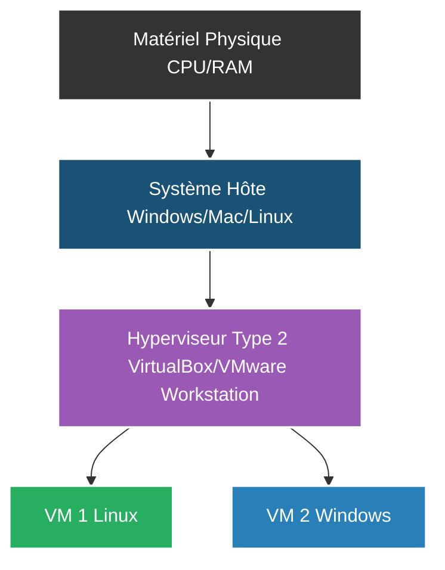
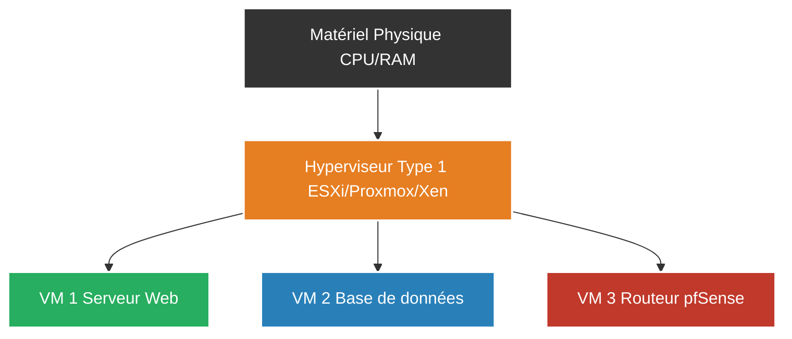

# Panorama des Hyperviseurs

!!! quote "Analogie pédagogique"
    _La virtualisation s'apparente à la construction de plusieurs appartements (Machines Virtuelles) au sein d'un même grand immeuble (Serveur Hyperviseur physique). L'hyperviseur s'assure que chaque locataire reçoit son quota d'électricité et d'eau (CPU, RAM) sans jamais pouvoir entrer par effraction chez son voisin._

!!! quote "Le chef d'orchestre matériel"
    _Pour faire tourner 5 ordinateurs virtuels sur 1 seul ordinateur physique, il faut un chef d'orchestre capable de prêter le CPU, la RAM et le disque dur à tour de rôle sans que les systèmes ne se marchent sur les pieds. Ce chef d'orchestre s'appelle un **Hyperviseur** (ou VMM : Virtual Machine Monitor)._

## 1. Hyperviseur de Type 2 (Hosted)

C'est celui que vous connaissez le mieux, souvent utilisé sur les ordinateurs personnels (Laptops).
L'hyperviseur est installé **comme un simple logiciel** par-dessus votre système d'exploitation existant (ex: Windows 11 ou Ubuntu).

```mermaid
graph TD
    Hardware[Matériel Physique CPU/RAM] --> HostOS[Système Hôte Windows/Mac/Linux]
    HostOS --> Hypervisor[Hyperviseur Type 2 VirtualBox/VMware Workstation]
    Hypervisor --> VM1[VM 1 Linux]
    Hypervisor --> VM2[VM 2 Windows]
    
    style Hardware fill:#333,stroke:#fff,stroke-width:2px,color:#fff
    style HostOS fill:#1a5276,stroke:#fff,stroke-width:2px,color:#fff
    style Hypervisor fill:#9b59b6,stroke:#fff,stroke-width:2px,color:#fff
    style VM1 fill:#27ae60,stroke:#fff,stroke-width:2px,color:#fff
    style VM2 fill:#2980b9,stroke:#fff,stroke-width:2px,color:#fff
```

- **Exemples** : Oracle VirtualBox, VMware Workstation, Parallels Desktop.
- **Avantages** : Très facile à installer. Idéal pour tester un nouveau système (ex: essayer Kali Linux sans effacer Windows).
- **Inconvénients** : **Performances faibles**. Pour qu'une VM accède au CPU, l'instruction doit traverser l'hyperviseur, PUIS traverser l'OS Hôte, PUIS aller au CPU. Il n'est **jamais** utilisé en production dans les data-centers.

---

## 2. Hyperviseur de Type 1 (Bare-Metal)

C'est le standard de l'industrie, du Cloud public (AWS/Azure) à la salle serveur d'une entreprise.
L'hyperviseur est installé **directement sur le matériel** ("Bare-Metal" : métal nu). Il n'y a pas d'OS intermédiaire lourd (comme Windows) en dessous.

```mermaid
graph TD
    Hardware[Matériel Physique CPU/RAM] --> Hypervisor[Hyperviseur Type 1 ESXi/Proxmox/Xen]
    Hypervisor --> VM1[VM 1 Serveur Web]
    Hypervisor --> VM2[VM 2 Base de données]
    Hypervisor --> VM3[VM 3 Routeur pfSense]
    
    style Hardware fill:#333,stroke:#fff,stroke-width:2px,color:#fff
    style Hypervisor fill:#e67e22,stroke:#fff,stroke-width:2px,color:#fff
    style VM1 fill:#27ae60,stroke:#fff,stroke-width:2px,color:#fff
    style VM2 fill:#2980b9,stroke:#fff,stroke-width:2px,color:#fff
    style VM3 fill:#c0392b,stroke:#fff,stroke-width:2px,color:#fff
```

- **Exemples** : VMware ESXi, Microsoft Hyper-V, Proxmox (KVM), XenServer.
- **Avantages** : **Performances quasi-natives**. Les VM parlent presque directement au processeur. Stabilité extrême (le crash d'une VM n'impacte pas l'hyperviseur).
- **Inconvénients** : Nécessite une machine dédiée. Pas d'interface graphique locale (on l'administre toujours à distance via le réseau).

---

## 3. L'Accélération Matérielle (VT-x / AMD-V)

Aujourd'hui, la virtualisation est performante parce que les processeurs modernes l'aident matériellement. 
Intel a créé la technologie **VT-x** et AMD a créé **AMD-V**. 

Ces technologies ajoutent un jeu d'instructions directement gravé dans le silicium du CPU, permettant à l'hyperviseur de déléguer certaines tâches de sécurité et d'isolation directement au processeur, évitant un coûteux traitement logiciel.
*(C'est pour cela qu'il faut souvent aller activer la "Virtualisation" dans le BIOS d'un vieil ordinateur avant d'installer VirtualBox).*

## Conclusion
Si vous montez un "Home Lab" ou si vous êtes embauché pour gérer l'infrastructure d'une PME, le choix se portera toujours sur un hyperviseur de Type 1. L'installation d'une solution Bare-Metal (comme Proxmox) transforme un simple PC avec 32 Go de RAM en un véritable Data Center miniature capable de faire tourner 10 serveurs indépendants.

 

---

## Conclusion

!!! quote "Ce qu'il faut retenir"
    La virtualisation (KVM, Proxmox) couplée à l'Infrastructure as Code (Packer, Vagrant) permet de déployer des environnements reproductibles, immuables et sécurisés dès leur conception (Security by Design).

> [Retourner à l'index →](../index.md)
