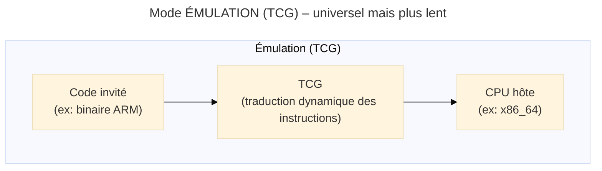
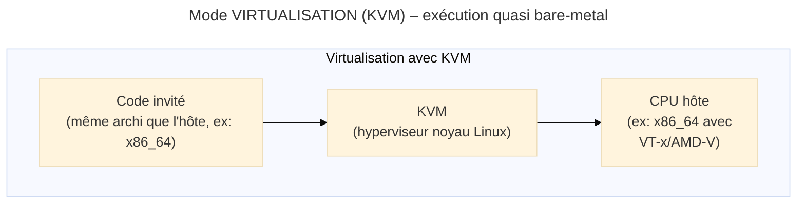
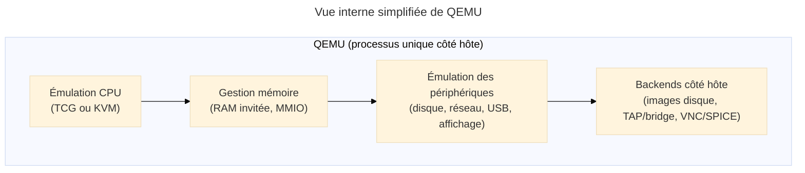

# QEMU - (Émulateur)

<div
  class="omny-meta"
  data-level="🟡 Intermédiaire & 🔴 Avancé"
  data-version="1.3"
  data-time="60-75 minutes">
</div>

## Introduction aux bases générales de QEMU

!!! quote "Analogie pédagogique"
    _Imaginez un **traducteur universel** capable de simuler n'importe quel processeur du monde : vous lui confiez un programme écrit pour un processeur ARM (smartphone), et il le fait tourner sur votre processeur x86 (PC). Mais ce traducteur possède aussi un mode **turbo** : quand le programme est déjà dans la langue native de votre machine, il le laisse s'exécuter directement à pleine vitesse grâce à KVM[^1]. **QEMU fonctionne exactement ainsi** : c'est un émulateur polyvalent qui peut simuler des dizaines d'architectures différentes, mais qui devient un hyperviseur ultra-performant quand il s'associe au noyau Linux via KVM[^1]._

**QEMU** (Quick Emulator) constitue un **émulateur et virtualiseur open-source** capable de simuler une machine complète : _processeur_, _mémoire_, _périphériques_, _réseau_. Créé en 2003 par Fabrice Bellard, QEMU est devenu la **pierre angulaire** ou **brique fondamentale** de l'écosystème de virtualisation Linux, servant de fondation à KVM et libvirt, et par extension à Proxmox VE, OpenStack, etc.

Dans un contexte où les infrastructures modernes reposent sur la virtualisation pour _l'isolation_, _la scalabilité_ et _la résilience_, comprendre QEMU permet de maîtriser les **fondations techniques** sur lesquelles s'appuient les plateformes de production. Pour un professionnel de la cybersécurité, QEMU offre également un environnement idéal pour l'**analyse de malware**, le **reverse engineering** et la création de **laboratoires d'attaque isolés**.

!!! info "Pourquoi maîtriser QEMU ?"
    - **Fondation de l'écosystème Linux** :  
      _KVM, libvirt, Proxmox, OpenStack utilisent tous QEMU comme backend d'exécution._
    
    - **Émulation multi-architecture** :  
      _Tester du code ARM sur x86, analyser des firmwares embarqués, développer pour IoT._
    
    - **Flexibilité maximale** :  
      _Contrôle fin sur chaque aspect de la VM : CPU, mémoire, réseau, stockage._
    
    - **Snapshots et introspection** :  
      _Capturer l'état d'une VM, analyser la mémoire, debugger des systèmes._

---

## Pour repartir des bases

!!! quote "Pré-requis recommandé"
    Avant tout, pour comprendre où se situe QEMU dans l'écosystème global de la virtualisation
    (_Type 1 / Type 2_, _VirtualBox_, _VMware_, _Hyper-V_, _WSL_, _KVM_, _libvirt_, _Proxmox_),
    commence par la page **“Panorama de la virtualisation”**.

Si vous découvrez QEMU, quatre points fondamentaux sont à retenir :

### 1. Deux modes : Émulation vs Virtualisation

QEMU opère selon **deux modes distincts** qui répondent à des besoins différents :

- **Mode émulation (TCG – Tiny Code Generator)**  
  _QEMU traduit dynamiquement les instructions de l’architecture invitée vers celles de l’architecture hôte.  
  Tu peux par exemple exécuter du code ARM sur un CPU x86._

!!! quote "C’est **lent mais universel**"


<small>_En mode émulation TCG, QEMU traduit les instructions d’une architecture invitée (ex : ARM) vers l’architecture de l’hôte (ex : x86_64). C’est très flexible (toutes architectures), mais sensiblement plus lent que l’exécution native._</small>

- **Mode virtualisation (avec KVM)**  
  _QEMU délègue l’exécution des instructions CPU au noyau Linux via **KVM**[^1]. Le code invité s’exécute **nativement sur le CPU physique**, avec très peu de surcoût, mais uniquement si `l’architecture invitée = architecture hôte` (x86 sur x86, etc.) et que le CPU dispose de VT-x / AMD-V.[^2]_

!!! tip "Performances proches du bare-metal"


<small>_En mode virtualisation KVM, les instructions invitées s’exécutent presque directement sur le CPU physique. Les performances sont proches du bare-metal, mais cela ne fonctionne que si l’architecture invitée est identique à celle de l’hôte, avec support VT-x/AMD-V._</small>

!!! note "À retenir"
    L’**émulation** te permet de tester des **architectures exotiques** (ARM, MIPS, RISC-V…) au prix de performances faibles.
    La **virtualisation avec KVM** te donne des performances **proches du bare-metal**, mais uniquement pour la même architecture et avec support matériel.

??? abstract "Approfondir : fonctionnement interne de TCG"

    **TCG** (*Tiny Code Generator*) est le moteur d’**émulation pure** de QEMU : il joue le rôle de compilateur JIT qui traduit à la volée les instructions de l’architecture invitée vers celles de l’architecture hôte.

    Schématiquement, pour chaque portion de code invité :

    1. **Fetch** – QEMU lit les instructions de la VM (ex : ARM).
    2. **Decode** – Elles sont converties dans une représentation intermédiaire.
    3. **Translate** – Cette IR est compilée en instructions natives pour le CPU hôte.
    4. **Cache** – Le bloc traduit est mis en cache pour être réutilisé.
    5. **Execute** – Le CPU exécute directement ce bloc natif.

    **Forces :**  

    - [x] fonctionne sans VT-x/AMD-V,  
    - [x] supporte quasiment *toutes* les architectures (ARM, MIPS, RISC-V, …),  
    - [x] offre une très bonne introspection de l’état CPU.

    **Limites :**  

    - [ ] **beaucoup plus lent** que l’exécution native (facteur 10–100x),  
    - [ ] consomme fortement le CPU hôte sur des charges longues.

    En résumé : **TCG = flexibilité maximale, performances minimales**, idéal pour le *cross-architecture*, le firmware embarqué et le debug bas niveau.


??? abstract "Approfondir : rôle exact de KVM et du noyau"

    **KVM** (*Kernel-based Virtual Machine*) transforme le noyau Linux en **hyperviseur de type 1** : les instructions de la VM s’exécutent directement sur le CPU physique grâce aux extensions VT-x/AMD-V, tandis que QEMU se concentre sur l’**émulation des périphériques** (disque, réseau, USB, affichage…).

    Vue simplifiée de la pile :

    ```text
    ┌─────────────────────────────────────────┐
    │          Guest OS (VM)                 │
    ├─────────────────────────────────────────┤
    │        QEMU (devices virtuels)         │
    ├─────────────────────────────────────────┤
    │        Module KVM (kvm.ko)             │
    ├─────────────────────────────────────────┤
    │            Noyau Linux                 │
    ├─────────────────────────────────────────┤
    │   Matériel avec VT-x / AMD-V activé    │
    └─────────────────────────────────────────┘
    ```

    **Rôle de chacun :**

    - **KVM** gère l’exécution CPU et la mémoire invitée en s’appuyant sur le matériel.  
    - **QEMU** intercepte les accès I/O, émule les périphériques et pilote la VM.  
    - Le **noyau Linux** fournit l’isolation, les cgroups, le scheduling, etc.

    Avec KVM activé, on obtient des performances **95–99 % du bare-metal**, à condition que l’architecture invitée soit identique à celle de l’hôte (x86 sur x86, ARM sur ARM) et que les modules `kvm`, `kvm_intel` ou `kvm_amd` soient correctement chargés.

---

### 2. QEMU simule une machine complète

Contrairement aux conteneurs qui partagent le noyau de l’hôte, QEMU émule **l'intégralité du matériel** ce qui peut simplement se traduire par **toute la machine** :

* **CPU** : x86, x86_64, ARM, AARCH64, MIPS, RISC-V, PowerPC, SPARC, etc.
* **Mémoire** : RAM configurable, éventuellement optimisée via **huge pages**.[^3]
* **Stockage** : disques virtuels (qcow2, raw, vmdk, vdi…), CD-ROM, USB.
* **Réseau** : cartes réseau virtuelles (e1000, virtio-net…), NAT[^4], bridge, tap.
* **Périphériques** : GPU virtuel, audio, contrôleur USB, TPM virtuel.
* **Firmware** : BIOS (SeaBIOS), UEFI (OVMF), Coreboot.

!!! note "Zoom : vue interne simplifiée de QEMU"


<small>Cette vue montre comment QEMU sépare l’émulation CPU (TCG/KVM), la mémoire invitée, l’émulation des périphériques et les backends de stockage/réseau.</small>

!!! quote "Cela permet de **reproduire des scénarios très proches d’un vrai serveur** (ou d’un équipement embarqué) sans disposer du matériel physique."

---

### 3. QEMU dans l’écosystème de virtualisation

QEMU ne fonctionne pas seul en production. Il s'intègre dans une **stack de virtualisation** qui comprends :

* **libvirt** : API de gestion et d’orchestration.
* **KVM** : module noyau transformant Linux en hyperviseur de type 1.[^5]
* **Interfaces** : Proxmox VE, virt-manager, Cockpit, OpenStack…

=== "Niveau 1 : Interfaces utilisateur"

    **Vue 1 — Les interfaces utilisateur (le “haut” de la stack)**

    ```mermaid
    ---
    title: "Niveau 1 : Interfaces utilisateur"
    config:
      theme: "base"
    ---
    graph TB
        Frontend[/"Frontend"/]
        subgraph INTERFACE["Interfaces utilisateur"]
          UI1["Proxmox VE<br/>(gestion cluster, GUI web)"]
          UI2["virt-manager<br/>(administration locale en GUI)"]
          UI3["Cockpit<br/>(GUI serveur + virtualisation)"]
        end
        
        subgraph ORCHESTRATION["Couche de gestion"]
          O1["libvirt<br/>(API centrale)"]
        end

        UI1 --> O1
        UI2 --> O1
        UI3 --> O1
        INTERFACE -.aussi appelé.- Frontend
    ```
    <small>_Les interfaces comme Proxmox, virt-manager ou Cockpit ne parlent jamais directement à QEMU ou KVM. Elles s’appuient toutes sur libvirt, qui joue le rôle de couche d’orchestration et d’API unifiée._</small>

=== "Niveau 2 : libvirt"

    ```mermaid
    ---
    title: "Niveau 2 : libvirt — API et gestion des VM"
    config:
      theme: "base"
    ---
    graph LR
        subgraph ORCHESTRATION["Couche de gestion"]
            O1["libvirt<br/>(API + daemon libvirtd)"]
            O2["virsh CLI<br/>(console d'administration libvirt)"]
        end
        
        Backend[/"Backend"/]
        subgraph EXECUTION["Moteur d'exécution"]
            Q["QEMU<br/>(émulation + périphériques)"]
        end

        O2 --> O1
        O1 --> Q
        Q -.Aussi appelé.- Backend

    ```
    <small>_libvirt fournit une API stable et universelle pour créer, démarrer, arrêter ou configurer une VM. virsh est la CLI officielle qui contrôle ce daemon. libvirt ne crée pas les VMs lui-même : il invoque QEMU comme moteur d’exécution._</small>

=== "Niveau 3 : QEMU & KVM"

    ```mermaid
    ---
    title: "Niveau 3 : QEMU & KVM — Exécution et accélération"
    config:
      theme: "base"
    ---
    graph LR
        subgraph EXECUTION["Moteur d'exécution (VMs)"]
            Q["QEMU<br/>(émulation CPU + périphériques virtuels)"]
            K["KVM<br/>(accélération matérielle)"]
        end
        
        subgraph KERNEL["Noyau Linux de l'hôte"]
            L["kvm.ko<br/>(module hyperviseur générique)"]
            L2["kvm_intel / kvm_amd<br/>(spécifique au CPU)"]
        end

        Q --> K
        K --> L
        L --> L2
    ```
    <small>_QEMU gère l’émulation et les périphériques, mais délègue l’exécution CPU au module KVM du noyau Linux. KVM s’appuie sur des extensions matérielles (VT-x/AMD-V) via kvm_intel ou kvm_amd pour exécuter le code invité quasi nativement._</small>

=== "Vue d'ensemble"

    ```mermaid
    ---
    title: "Vue d'ensemble : Stack complète de virtualisation Linux"
    config:
      theme: "base"
    ---
    graph LR
        subgraph INTERFACE["Nv1 : Interfaces utilisateur"]
            direction TB
            UI1["Proxmox VE<br/>(cluster, GUI web)"]
            UI2["virt-manager<br/>(GUI poste admin)"]
            UI3["Cockpit<br/>(GUI serveur)"]
        end
        
        subgraph ORCHESTRATION["Nv2 : Couche de gestion"]
            direction LR
            O1["libvirt<br/>(API + daemon libvirtd)"]
            O2["virsh CLI<br/>(ligne de commande libvirt)"]
        end
        
        subgraph EXECUTION["Nv3 : Exécution des VMs"]
            direction LR
            Q["QEMU<br/>(moteur + périphériques)"]
            K["KVM<br/>(accélération CPU)"]
        end
        
        subgraph KERNEL["Nv4 : Noyau Linux"]
            direction LR
            L["kvm.ko<br/>(module KVM)"]
            L2["kvm_intel / kvm_amd<br/>(support matériel)"]
        end
        
        UI1 --> O1
        UI2 --> O1
        UI3 --> O1
        O2 --> O1
        O1 --> Q
        Q --> K
        K --> L
        L --> L2
    ```
    <small>_Les interfaces (Proxmox, virt-manager, Cockpit) → s’appuient sur libvirt → qui invoque QEMU → qui s’appuie sur KVM → qui exploite les modules du noyau. C’est la chaîne complète d’un environnement de virtualisation Linux moderne._</small>

!!! note "À retenir"
    QEMU est le **moteur d’exécution** des VMs. **libvirt** fournit la **couche de gestion** (XML, virsh, API) quant aux outils comme **Proxmox** ou **virt-manager** sont essentiellement des **frontends** par-dessus libvirt.

---

### 4. Cas d’usage typiques

Quelques cas d’usage fréquents :

- [x] Monter une **infrastructure de virtualisation KVM/libvirt** locale.
- [x] Tester un **OS ou une distrib** sans toucher à la machine physique.
- [x] Faire du **développement cross-plateforme** (par exemple, ARM sur x86) via émulation.
- [x] Monter un **environnement de test jetable** pour scripts, configurations, déploiements.
- [x] Tests **multi-plateforme** pour valider un logiciel sur différentes architectures CPU.
- [x] Mettre en place des cas d’usage plus **“cyber”** (**malware**, **IoT**, **pentest**) 
- [ ] _et bien d'autres encore_.

---

## Pré-requis : vérifier le support KVM

### Fiche 1 – Vérifier la virtualisation matérielle

Avant même de travailler avec QEMU et KVM, il est indispensable de s’assurer que la machine hôte peut exploiter la virtualisation matérielle. Cette fiche permet de **vérifier rapidement la présence des extensions CPU** (_VT-x/AMD-V_), **l’état des modules KVM dans le noyau Linux** et **les permissions nécessaires pour accéder au device** `/dev/kvm`.

!!! info "Sans ces prérequis, QEMU fonctionne uniquement en mode « émulation pure », ce qui limite fortement les performances et l’usage en production."

```bash
# Vérifier si le CPU supporte la virtualisation matérielle
# Intel : drapeau VMX ; AMD : drapeau SVM
grep -E "(vmx|svm)" /proc/cpuinfo | head -5
```

!!! warning "Si à ce stade, la commande ne renvoie rien, le CPU **ne supporte pas** VT-x/AMD-V[^2] ou c'est que la fonctionnalité est désactivée dans le BIOS/UEFI."

```bash
# Vérifier la présence des modules KVM
lsmod | grep kvm

# Exemple de résultat attendu (Intel) :
# kvm_intel             368640  0
# kvm                  1028096  1 kvm_intel

# Résultat attendu (AMD) :
# kvm_amd               155648  0
# kvm                  1028096  1 kvm_amd
```

```bash
# Charger les modules si nécessaire
sudo modprobe kvm
sudo modprobe kvm_intel    # ou kvm_amd
```

```bash
# Vérifier l’accès au device KVM
ls -la /dev/kvm
# crw-rw---- 1 root kvm 10, 232 ... /dev/kvm

# Ajouter ton utilisateur au groupe kvm (évite sudo)
sudo usermod -aG kvm "$USER"
# (déconnexion / reconnexion requise)
```

!!! note "À retenir"
    Sans `/dev/kvm` accessible, tu restes en **émulation pure (TCG)** :  
    _ça marche, mais c’est très lent. Pour de la **virtualisation performante**, KVM est indispensable._

---

## Installation de QEMU + libvirt

### Fiche 2 – Installation sur différentes distrib'

Cette fiche propose une installation propre et standardisée de **QEMU**, **KVM**, **libvirt** et **virt-manager** selon les principales distributions Linux. Elle fournit les commandes essentielles pour disposer d’un environnement complet : _moteur QEMU_, _accélération KVM_, _API libvirt_, _outils de création de VM_ et _interface graphique_.

!!! info "L’objectif est d’obtenir une base stable et uniforme pour la suite des manipulations."

=== ":fontawesome-brands-debian:  Debian / :fontawesome-brands-ubuntu: Ubuntu"

    ```bash
    # Mise à jour des paquets
    sudo apt update && sudo apt upgrade -y

    # Installation QEMU + libvirt + interface graphique
    sudo apt install -y \
        qemu-system-x86 \
        qemu-system-arm \
        qemu-system-misc \
        qemu-utils \
        qemu-block-extra \
        ovmf \
        libvirt-daemon-system \
        libvirt-clients \
        virtinst \
        virt-manager \
        bridge-utils

    # Activer libvirt
    sudo systemctl enable --now libvirtd

    # Ajouter ton utilisateur aux groupes
    sudo usermod -aG libvirt,kvm "$USER"
    ```

    !!! info "Explication des outils"
        - **qemu-system-x86** : _Émulation x86/x86_64_
        - **qemu-system-arm** : _Émulation ARM_
        - **qemu-system-misc** : _Autres architectures_
        - **qemu-utils** : _qemu-img, qemu-nbd..._
        - **qemu-block-extra** : _Formats additionnels_
        - **ovmf** : _Firmware UEFI_
        - **libvirt-daemon-system** : _Service libvirtd_
        - **libvirt-clients** : _virsh_
        - **virtinst** : _virt-install_
        - **virt-manager** : _Interface graphique_
        - **bridge-utils** : _Outils bridge réseau_

=== "RHEL / Rocky / AlmaLinux"

    ```bash
    # Installation des groupes de virtualisation
    sudo dnf groupinstall -y "Virtualization Host" "Virtualization Client"
    
    # Ou installation manuelle des paquets
    sudo dnf install -y \
        qemu-kvm \
        qemu-img \
        libvirt \
        libvirt-client \
        virt-install \
        virt-manager \
        edk2-ovmf
    
    # Activer et démarrer libvirt
    sudo systemctl enable --now libvirtd
    
    # Ajouter l'utilisateur aux groupes
    sudo usermod -aG libvirt,kvm $USER
    
    # Ouvrir le pare-feu pour VNC (optionnel)
    sudo firewall-cmd --add-service=vnc-server --permanent
    sudo firewall-cmd --reload
    ```

    !!! info "Explication des outils"
        - **qemu-kvm** : _QEMU avec support KVM_
        - **qemu-img** : _Manipulation d'images disque_
        - **libvirt** : _API de gestion_
        - **libvirt-client** : _CLI virsh_
        - **virt-install** : _Création de VMs_
        - **virt-manager** : _Interface graphique_
        - **edk2-ovmf** : _Firmware UEFI_

=== "Arch Linux"

    ```bash
    # Installation des paquets
    sudo pacman -S \
        qemu-full \                 # QEMU complet (toutes architectures)
        libvirt \                   # API de gestion
        virt-manager \              # Interface graphique
        virt-viewer \               # Affichage VNC/SPICE
        dnsmasq \                   # DHCP/DNS pour réseau virtuel
        bridge-utils \              # Configuration bridge
        edk2-ovmf                   # Firmware UEFI
    
    # Activer les services
    sudo systemctl enable --now libvirtd
    
    # Configurer les groupes
    sudo usermod -aG libvirt,kvm $USER
    ```

    !!! info "Explication des outils"
        - **qemu-full** : _QEMU complet (toutes architectures)_
        - **libvirt** : _API de gestion_
        - **virt-manager** : _Interface graphique_
        - **virt-viewer** : _Affichage VNC/SPICE_
        - **dnsmasq** : _DHCP/DNS pour réseau virtuel_
        - **bridge-utils** : _Configuration bridge_
        - **edk2-ovmf** : _Firmware UEFI_

### Contrôles & Configuration post-installation

Il ne faut surtout pas omettre la phase de contrôle pour savoir si tout s'est installé correctement.

```bash
# Vérifier que libvirt fonctionne
sudo systemctl status libvirtd

# Lister les réseaux virtuels disponibles
virsh net-list --all

# Démarrer le réseau par défaut (NAT)
virsh net-start default
virsh net-autostart default

# Vérifier la connexion QEMU
virsh -c qemu:///system list --all

# Créer un répertoire pour les images disque
sudo mkdir -p /var/lib/libvirt/images
sudo chown root:libvirt /var/lib/libvirt/images
sudo chmod 775 /var/lib/libvirt/images
```

---

## Comprendre les formats d’images disque

### Comparatif rapide

| Format    | Extension     |Avantages (✅) | Inconvénients (❌)                | Cas d’usage principal       |
| --------- | ------------- | ------------------------------------------------------ | ----------------------------- | --------------------------- |
| **qcow2** | `.qcow2`      | Snapshots, compression, thin provisioning[^6], chiffrement | Légèrement plus lent que raw  | Production, développement, labs   |
| **raw**   | `.img` `.raw` | Performances maximales, format simple                  | Taille fixe, pas de snapshots | I/O intensives, benchmark   |
| **vmdk**  | `.vmdk`       | Compatibilité VMware                                   | Moins flexible sous QEMU      | Migration depuis VMware     |
| **vdi**   | `.vdi`        | Compatibilité VirtualBox                               | Peu d’intérêt en natif QEMU   | Migration depuis VirtualBox |
| **vhdx**  | `.vhdx`       | Compatibilité Hyper-V                                  | Support plus limité           | Migration depuis Hyper-V    |

!!! success "qcow2 grand vainqueur"
    Dans 90 % des cas sur une infra QEMU/KVM moderne, **qcow2** est le bon choix : 

    - snapshots
    - compression
    - thin provisioning[^6]
    - backing files

---

## Fiches qemu-img (micro-recettes)

Cette section regroupe une série de **micro-fiches autour de `qemu-img`** : _création d’images_, _inspection_, _conversion_, _redimensionnement_ et _gestion avancée des snapshots_ / _backing files_[^7].  

> L’idée est d’avoir **des commandes courtes, réutilisables** et faciles à intégrer dans des scripts ou playbooks d’admin / cyber.

### Fiche 3 – Créer une image disque

Créer une image disque est **la première étape avant l’installation** ou **l’import d’un système invité**. Cette fiche présente la création d’images aux formats **RAW** et **QCOW2**, en précisant _les différences pratiques entre préallocation, allocation dynamique et optimisation performance_.

!!! info "Elle constitue la fondation de toute VM, que ce soit pour un usage classique, un lab cyber ou une infrastructure KVM/libvirt."

```bash
# Créer une image "qcow2" de 50 Go (thin provisioning)
# L'espace n'est alloué que lors de l'écriture soit à la demande
qemu-img create -f qcow2 debian.qcow2 50G
```

```bash
# Créer une image "qcow2" avec préallocation (meilleures performances)
# L'espace est réservé immédiatement sur le disque
qemu-img create -f qcow2 -o preallocation=full debian.qcow2 50G
```

```bash
# Image raw (taille fixe, perfs maximales)
qemu-img create -f raw disk.raw 50G
```

---

### Fiche 4 – Inspecter et vérifier une image

**Comprendre l’état d’une image disque** est essentiel pour **le diagnostic**, **la maintenance** ou **l’investigation**. Cette fiche explique comment inspecter une image (_format_, _taille virtuelle_/_réelle_, _compression_, _chaînes de backing files_[^7]) et _comment en vérifier l’intégrité_.

!!! info "Elle est particulièrement utile lors de migrations de VM, d’opérations de sauvegarde ou d’analyse forensic."

```bash
# Obtenir des informations détaillées d'une image
qemu-img info debian.qcow2

# Résultat type :
# image: debian.qcow2
# file format: qcow2
# virtual size: 50 GiB (53687091200 bytes)
# disk size: 1.2 GiB                        ← Taille réelle sur disque
# cluster_size: 65536
# Format specific information:
#     compat: 1.1
#     compression type: zlib
#     lazy refcounts: false
#     refcount bits: 16
#     corrupt: false
#     extended l2: false
```

```bash
# Vérifier l’intégrité basique de l’image
qemu-img check debian.qcow2
```

---

### Fiche 5 – Convertir entre formats

Les infrastructures ne reposent pas toutes sur les mêmes hyperviseurs, et il est fréquent de devoir convertir des images entre formats (**VMDK**, **RAW**, **QCOW2**, **VDI**). Cette fiche détaille le processus de conversion avec qemu-img, tout en expliquant **quand** et **pourquoi** passer d’un format à un autre : _migration depuis VMware_/_VirtualBox_, _optimisation de stockage_, _compatibilité avec KVM_/_libvirt_ ou _Proxmox_.

```bash
# Convertir RAW vers QCOW2
qemu-img convert -f raw -O qcow2 disk.raw disk.qcow2
```

```bash
# Convertir VMDK (VMware) vers QCOW2
qemu-img convert -f vmdk -O qcow2 vm.vmdk vm.qcow2
```

```bash
# Conversion avec compression (réduit la taille)
qemu-img convert -c -f raw -O qcow2 disk.raw disk-compressed.qcow2
```

---

### Fiche 6 – Redimensionner une image

Lorsqu’une VM nécessite plus d’espace disque (_ou exceptionnellement moins_), **il faut ajuster la taille de l’image virtuelle avant d’intervenir dans le système invité**. Cette fiche présente **les bonnes pratiques** et **les risques**, en particulier lors de la réduction d’une image, qui exige une manipulation rigoureuse des partitions internes.

!!! info "Elle clarifie la différence entre modifier la taille virtuelle et ajuster le filesystem dans la VM."

```bash
# Augmenter la taille virtuelle de 20 Go
qemu-img resize debian.qcow2 +20G
```

```bash
# Fixer la taille virtuelle à 100 Go
qemu-img resize debian.qcow2 100G
```

```bash
# Réduire une image (dangereux si les partitions ne sont pas réduites avant)
qemu-img resize --shrink debian.qcow2 30G
```

> En pratique : **agrandir** n’est pas un problème si tu agrandis ensuite la partition dans la VM.  
> **Réduire** une image est risqué si le filesystem n’a pas été réduit proprement dans l’invité.

!!! danger "**ATTENTION**, nous insistons sur le fait que **réduire une image** peut **causer une perte de données**, il faut d'abord **réduire les partitions** à l'intérieur de la VM, c'est un impératif majeur."

---

### Fiche 7 – Snapshots internes et backing files

**Les snapshots** et **les overlays QCOW2** sont au cœur des workflows modernes : _labs cyber_, _environnements jetables_, _tests reproductibles_, _golden images_. Cette fiche détaille l’utilisation des snapshots internes, mais aussi la création et la gestion des “backing files”[^7] (images différentielles). 

!!! info "Elle montre comment isoler les changements, restaurer rapidement un état antérieur et construire des chaînes d’images efficaces pour le développement et la cybersécurité."

!!! quote "**qcow2** est le format qui supporte nativement les snapshots internes. Les autres formats peuvent bénéficier de snapshots via des overlays ou des mécanismes externes (_libvirt_, _LVM_…)."

```bash
# Créer un snapshot interne (qcow2)
qemu-img snapshot -c "avant-maj" debian.qcow2

# Lister les snapshots
qemu-img snapshot -l debian.qcow2

# Restaurer un snapshot
qemu-img snapshot -a "avant-maj" debian.qcow2

# Supprimer un snapshot
qemu-img snapshot -d "avant-mise-a-jour" disk.qcow2
```

---

### **Bonus – Images différentielles / Backing Files**

Les images différentielles permettent d’utiliser une **image de base propre** (*golden image*) tout en stockant les modifications dans un fichier séparé appelé **overlay**. Cette technique évite de dupliquer des disques entiers, réduit drastiquement l’espace consommé et simplifie les scénarios de test ou de formation.

Grâce aux **backing files**[^7], on peut multiplier les environnements dérivés, revenir rapidement à un état initial, fusionner les changements ou reconstruire une chaîne complète d’images.

!!! info "Ce mécanisme est particulièrement utile pour les labs, les environnements jetables et toutes les situations où l’on souhaite *expérimenter sans jamais altérer l’image d’origine*."

```bash
# Créer un overlay basé sur une image de base
qemu-img create -f qcow2 -b base.qcow2 -F qcow2 overlay.qcow2

# Afficher la chaîne de backing files
qemu-img info --backing-chain overlay.qcow2

# Fusionner un overlay avec sa base (commit)
qemu-img commit overlay.qcow2

# Rebase : changer l'image de base
qemu-img rebase -b new-base.qcow2 -F qcow2 overlay.qcow2
```

!!! note "À retenir"
    Les **overlays** permettent de garder une **image de base propre** (golden image) et de stocker les modifications dans des fichiers séparés. _C’est une base pour les labs, mais aussi pour certains scénarios de prod._

---

## Comprendre la structure d'une cmd QEMU

### Signature d'une commande

```bash
# Structure générale d'une commande QEMU
qemu-system-<arch> [options machine] [options CPU] [options mémoire] \
                   [options disque] [options réseau] [options affichage] \
                   [options firmware] [options diverses]
```

### Options Machine, CPU & Mémoire

=== "Options : Machine"

    Les options _machine_ définissent la **plateforme matérielle simulée** par QEMU : _chipset_, _contrôleurs PCIe_, _compatibilité avec le firmware_, _support IOMMU_ et _comportement général du matériel virtuel_. Le choix entre un modèle classique comme `pc` et un modèle moderne comme `q35` influence directement les performances, la compatibilité des périphériques Virtio et la manière dont l’invité interagit avec l’hôte.
    
    !!! info "C’est ici que se décide l’équilibre entre compatibilité maximale et performances optimales."

    ```bash
    # Lister les machines disponibles
    qemu-system-x86_64 -machine help

    # Machine par défaut (pc = i440fx, ancienne mais compatible)
    -machine pc
    
    # Machine moderne (q35, recommandée pour les nouvelles VMs)
    # Supporte PCIe, IOMMU, meilleures performances
    -machine q35
    
    # Activer l'accélération KVM
    -machine q35,accel=kvm
    ```
    
=== "Options : CPU"

    Les options CPU déterminent la **modélisation du processeur virtuel** : _instructions disponibles_, _nombre de vCPUs_, _organisation en sockets_/_cores_/_threads_ et_ exposition des capacités matérielles de l’hôte_.  
    
    En mode KVM, utiliser `-cpu host` permet d’exposer quasi intégralement le CPU réel, garantissant des performances proches du bare-metal.
    
    !!! info "Cette section conditionne autant les performances que la compatibilité logicielle du système invité."

    ```bash
    # Lister les CPUs disponibles
    qemu-system-x86_64 -cpu help

    # CPU générique (compatible, lent)
    -cpu qemu64
    
    # CPU hôte (expose le CPU réel, meilleures performances avec KVM)
    -cpu host
    
    # CPU spécifique (émulation précise)
    -cpu Skylake-Server-v5
    
    # Nombre de vCPUs (virtual CPU)
    -smp 4
    
    # Configuration avancée : 4 vCPUs, 2 sockets, 2 cores par socket
    -smp 4,sockets=2,cores=2,threads=1
    ```

=== "Options : Mémoire"

    Ces options contrôlent la **quantité**, **l’organisation** et **le mode de gestion de la mémoire RAM** allouée à la VM. QEMU permet de définir _une taille fixe_, _une mémoire extensible_ (hotplug) ou _des optimisations_ comme les **huge pages**[^3] pour réduire la surcharge de gestion des pages.
    
    !!! info "Une bonne configuration mémoire améliore la stabilité, réduit la latence et optimise les charges intensives."

    ```bash    
    # Mémoire en mégaoctets
    -m 2048
    
    # Mémoire en gigaoctets
    -m 4G
    
    # Mémoire avec notation explicite
    -m size=4096M
    
    # Mémoire avec slots pour ajout à chaud (hotplug)
    -m 4G,slots=4,maxmem=16G
    ```
    
    **HUGE PAGES (performances)**
    
    ```bash
    # Utiliser des huge pages (2 Mo au lieu de 4 Ko)
    # Réduit la surcharge de gestion mémoire
    -mem-path /dev/hugepages
    
    # Configuration préalable sur l'hôte :
    # echo 2048 > /proc/sys/vm/nr_hugepages
    # ou dans /etc/sysctl.conf : vm.nr_hugepages = 2048
    ```

### Options Disque, Réseau & Affichage

=== "Options : Disque"

    Les options disque définissent la **connexion** et le **comportement des volumes virtuels** : _interface utilisée_ (**Virtio**, **IDE**, **SCSI**), _format_ (**qcow2**, **raw**), _stratégies de cache_, _fichier ISO_, _ordre de boot_ et _gestion du CD-ROM_.
    
    !!! info "Le paramétrage de cette section influence fortement les performances I/O, la sécurité des écritures, et la capacité à utiliser des fonctionnalités avancées comme les snapshots ou les overlays."

    **Stockage**

    ```bash
    # Disque simple (legacy, déprécié mais fonctionnel)
    -hda disk.qcow2
    
    # Syntaxe moderne avec -drive
    -drive file=disk.qcow2,format=qcow2,if=virtio
    
    # Explication des paramètres :
    # file=       : chemin vers l'image disque
    # format=     : format de l'image (qcow2, raw, vmdk...)
    # if=         : interface (virtio, ide, scsi)
    #               virtio = meilleures performances
    #               ide    = compatibilité maximale
    # cache=      : mode de cache (none, writeback, writethrough)
    #               none          = performances, risque perte données
    #               writeback     = performances avec cache
    #               writethrough  = sécurité, plus lent
    # aio=        : async I/O (native, threads)
    #               native = meilleures performances (requiert cache=none)
    
    # Configuration optimale pour production
    -drive file=disk.qcow2,format=qcow2,if=virtio,cache=none,aio=native
    ```

    **CD-ROM ET ISO**
    ```bash
    # Attacher un ISO comme CD-ROM
    -cdrom debian-12.iso
    
    # Syntaxe moderne
    -drive file=debian-12.iso,media=cdrom,readonly=on
    ```
    
    **ORDRE DE BOOT**
    ```bash
    # Boot sur CD-ROM en premier
    -boot d
    
    # Boot sur disque dur en premier
    -boot c
    
    # Menu de boot interactif
    -boot menu=on
    
    # Ordre de boot (c=hdd, d=cdrom, n=network)
    -boot order=dc    # ici : cdrom -> hdd
    ```

=== "Options : Réseau"

    Ces options contrôlent la **connexion de la VM au réseau** : _carte virtuelle utilisée_, _type de backend_ (**NAT**[^4], **user mode**, **tap**, **bridge**), _redirections de ports_, _modèles Virtio_ ou _cartes émulées classiques_. QEMU offre un large choix permettant aussi bien de connecter rapidement une VM à Internet que de construire un lab isolé, segmenté ou totalement autonome.
    
    !!! info "Le réseau est un des piliers de l’orchestration d’un environnement réaliste."

    **OPTIONS CARTE RÉSEAU**

    ```bash
    # Définir une adresse MAC spécifique
    -device virtio-net-pci,netdev=net0,mac=52:54:00:12:34:56
    
    # Types de cartes réseau :
    # virtio-net-pci : meilleures performances (requiert drivers virtio)
    # e1000          : compatibilité Intel Gigabit
    # rtl8139        : compatibilité anciens systèmes
    ```

    **MODE USER (NAT[^4] simple, pas de configuration hôte)**

    ```bash
    # Réseau NAT par défaut (la VM accède à Internet, pas l'inverse)
    -netdev user,id=net0 -device virtio-net-pci,netdev=net0
    
    # NAT avec redirection de port (SSH accessible depuis l'hôte)
    -netdev user,id=net0,hostfwd=tcp::2222-:22 \
    -device virtio-net-pci,netdev=net0
    
    # Multiples redirections de port
    -netdev user,id=net0,hostfwd=tcp::2222-:22,hostfwd=tcp::8080-:80 \
    -device virtio-net-pci,netdev=net0
    ```

    **MODE TAP/BRIDGE (performances production)**
    ```bash
    # Prérequis : créer un bridge sur l'hôte
    # sudo ip link add br0 type bridge
    # sudo ip link set br0 up
    # sudo ip link set eth0 master br0
    
    # Connexion au bridge (requiert sudo ou CAP_NET_ADMIN)
    -netdev tap,id=net0,br=br0,helper=/usr/lib/qemu/qemu-bridge-helper \
    -device virtio-net-pci,netdev=net0
    ```

=== "Options : Affichage"

    Les options d’affichage définissent la **manière dont la VM présente une interface graphique** : __fenêtre locale__ (**GTK**, **SDL**), _accès à distance_ (**VNC**, **SPICE**), _mode console seul_, ou _fonctionnement totalement headless_.
    
    !!! info "Cette section permet d’adapter la VM à un usage poste de travail, serveur distant, lab isolé ou environnement de test automatisé."

    **Affichage Graphique**

    ```bash
    # Affichage GTK (fenêtre native Linux)
    -display gtk
    
    # Affichage SDL
    -display sdl
    
    # Serveur VNC (accès distant)
    -display vnc=:0                  # Port 5900
    -display vnc=:1                  # Port 5901
    -display vnc=0.0.0.0:0           # Écoute sur toutes les interfaces
    
    # Serveur SPICE (meilleur que VNC, supporte audio/USB)
    -spice port=5900,disable-ticketing=on
    
    # Sans affichage (serveur headless)
    -display none
    -nographic                       # Console série uniquement
    ```

    **Carte Graphique Virtuelle**

    Ces options décrivent la **carte vidéo émulée** ou para-virtualisée par QEMU : ``std``, ``qxl``, ``virtio`` ou ``modèles historiques``. **Le choix du GPU virtuel influence** _la compatibilité avec l’invité_, _la performance de l’affichage_ et _l’expérience utilisateur_, en particulier avec ``SPICE`` ou les environnements graphiques modernes.
    
    !!! info "**Virtio-GPU** est privilégié pour ses performances, tandis que **QXL** reste pertinent pour les environnements **SPICE**."
    
    ```bash
    # VGA standard (compatibilité)
    -vga std
    
    # QXL (optimisé pour SPICE)
    -vga qxl
    
    # Virtio-GPU (meilleures performances 3D)
    -vga virtio
    
    # Cirrus (legacy, très anciens systèmes)
    -vga cirrus
    ```

### **Options Firmware & Diverses**

=== "Options : Firmware"

    Ces options contrôlent le **firmware utilisé par la machine virtuelle**, c’est-à-dire la phase d’amorçage qui précède le chargement du système d’exploitation. QEMU permet d’utiliser un **BIOS classique** (SeaBIOS) ou un **firmware UEFI** (OVMF), indispensable pour Windows 11, les systèmes modernes, le Secure Boot ou les environnements plus proches du matériel réel.

    !!! info "Choisir le bon firmware influence la compatibilité, la structure des disques, les performances au boot et certaines fonctions avancées comme le TPM ou le passthrough matériel."

    ```bash
    # Utiliser le firmware BIOS SeaBIOS (mode hérité)
    -bios /usr/share/qemu/bios.bin

    # Utiliser le firmware UEFI OVMF (recommandé pour Windows 10/11)
    -bios /usr/share/OVMF/OVMF_CODE.fd

    # Ajouter le fichier NVRAM (permet de sauvegarder les réglages UEFI)
    -drive if=pflash,format=raw,readonly=on,file=/usr/share/OVMF/OVMF_CODE.fd
    -drive if=pflash,format=raw,file=/var/lib/libvirt/qemu/nvram/win11_VARS.fd

    # UEFI avec Secure Boot (si ton OVMF le supporte)
    -bios /usr/share/OVMF/OVMF_CODE.secboot.fd
    ```

=== "Options : Diverses"

    Ces options regroupent les fonctionnalités transverses qui ne s’inscrivent pas dans une catégorie unique mais qui jouent un rôle essentiel dans la **stabilité**, la **visibilité** et la **personnalisation** d’une VM.
    
    On y retrouve **le nommage de la VM**, **la console série**, **le moniteur QEMU**, **les timers**, **la gestion des logs**, **le contrôle du shutdown ACPI**, ou encore **les paramètres influençant la sécurité** et la façon dont QEMU interagit avec l’hôte.
    
    !!! info "Ces réglages constituent la “boîte à outils générale” permettant d’adapter finement une VM à un cas d’usage particulier, qu’il s’agisse de test, de production ou de lab cybersécurité."

    ```bash
    # Nom interne de la VM
    -name "debian-test"

    # Horloge synchronisée sur l’hôte (important pour environnements sensibles au temps)
    -rtc base=localtime

    # Activer ACPI (arrêt propre depuis l’hôte)
    -acpi

    # Activer la pagination du moniteur QEMU (contrôle interactif)
    -monitor stdio

    # Exposer le moniteur sur un socket (snapshots, debug, automation)
    -monitor telnet:127.0.0.1:55555,server,nowait

    # Console série (utile en mode serveur ou pour debug kernel)
    -serial stdio

    # Activer un logfile QEMU
    -D /var/log/qemu/debian.log

    # Désactiver les périphériques par défaut (surface d’attaque réduite)
    -nodefaults

    # Ajouter manuellement un clavier/souris para-virtualisés
    -device virtio-keyboard-pci
    -device virtio-mouse-pci
    ```

---

## Exemples d'utilisations

Cette dernière partie propose une **série de recettes complètes** montrant comment assembler les options vues précédemment dans des cas concrets : _ISO de test_, _VM Linux de base_, _Windows 11_, _émulation ARM_, _lab malware_.  

Chaque exemple est pensé comme un **point de départ** : l’objectif n’est pas d’être exhaustif, mais de montrer une **structure de commande claire** que vous pourrez adapter à votre contexte (_RAM_, _CPU_, _réseau_, _stockage_).


### Exemple minimal : Booter sur un ISO

Cet exemple montre la structure la plus simple **pour démarrer une machine virtuelle uniquement depuis une image ISO**. Il sert d’introduction à QEMU avant d’ajouter le disque, le réseau, KVM ou les périphériques virtuels.

```bash
# Exemple minimal : Booter sur un ISO
qemu-system-x86_64 \
  -cdrom debian-12.iso \       # Image ISO du CD-ROM
  -boot d \                    # Booter sur le CD (d = cdrom)
  -m 2048                      # 2 Go de RAM
```
<small><i>Cet exemple illustre le mode de démarrage le plus simple : un ISO, de la RAM, pas de disque. Utile pour tester des images live ou valider que QEMU fonctionne correctement.</i></small>

### VM Linux minimale avec KVM

Cet exemple montre la structure d’une VM simple et performante en utilisant les options essentielles : machine ``q35``, CPU ``host``, _disque en Virtio_ et _NAT[^4] basique_. C’est le modèle standard pour lancer rapidement une VM Linux moderne avec d’excellentes performances.

```bash
#!/bin/bash
# VM Linux minimale avec KVM
# Usage : ./start-vm.sh

qemu-system-x86_64 \
  -name "debian-server" \
  -machine q35,accel=kvm \
  -cpu host \
  -smp 2 \
  -m 2G \
  -drive file=debian.qcow2,format=qcow2,if=virtio \
  -netdev user,id=net0,hostfwd=tcp::2222-:22 \
  -device virtio-net-pci,netdev=net0 \
  -display gtk
```
<small><i>Cette configuration illustre l’usage minimal d’une VM performante : **KVM activé**, **CPU natif**, **disque Virtio** et **NAT** pour un accès rapide à la machine via **SSH**. C’est la base de toutes les VMs Linux de test ou de développement.</i></small>

**Décryptage rapide :**

* `-machine q35,accel=kvm` : machine moderne avec accélération KVM.
* `-cpu host` : expose les fonctionnalités CPU de l’hôte pour maximiser les performances.
* `-smp 2` : 2 vCPUs.
* `-m 2048` : 2 Go de RAM.
* `-drive ... if=virtio` : disque virtuel en Virtio (performant).
* `-netdev user,hostfwd=...` + `-device virtio-net-pci` : réseau NAT avec port 2222 → 22 (SSH dans la VM depuis l’hôte).
* `-display gtk` : fenêtre graphique locale.

!!! warning "Après installation, tu pourras retirer `-cdrom` et passer en `-boot order=c` (disque)."

### VM Windows 11 avec UEFI

Cet exemple présente la configuration complète nécessaire **pour installer Windows 11** : _firmware UEFI_, _module TPM simulé_, _Virtio pour le disque_ et _SPICE pour l’affichage_. C’est une configuration réaliste de machine Windows moderne sous QEMU/KVM.

```bash
#!/bin/bash
# VM Windows 11 avec UEFI et TPM émulé

qemu-system-x86_64 \
  -name "windows11" \
  -machine q35,accel=kvm \
  -cpu host \
  -smp 4,cores=4 \
  -m 8G \
  \
  # Firmware UEFI (requis pour Windows 11)
  -bios /usr/share/OVMF/OVMF_CODE.fd \
  \
  # TPM émulé (requis pour Windows 11)
  -chardev socket,id=chrtpm,path=/tmp/swtpm.sock \
  -tpmdev emulator,id=tpm0,chardev=chrtpm \
  -device tpm-tis,tpmdev=tpm0 \
  \
  # Disque système
  -drive file=windows11.qcow2,format=qcow2,if=virtio \
  \
  # ISO d'installation et drivers VirtIO
  -drive file=Win11.iso,media=cdrom \
  -drive file=virtio-win.iso,media=cdrom \
  \
  # Réseau
  -netdev user,id=net0 \
  -device virtio-net-pci,netdev=net0 \
  \
  # Affichage haute performance
  -vga qxl \
  -display spice-app
```
<small><i>Cet exemple illustre les prérequis stricts de Windows 11 : UEFI, TPM 2.0, stockage Virtio et un affichage SPICE performant.</i></small>

### Booter sur un ISO Debian en QEMU/KVM

Ce modèle est conçu pour **une installation Debian complète**. Il combine _l’accélération KVM_, _un disque qcow2 performant_, _un accès SSH_ via _NAT[^4]_ et _une interface graphique locale_. C’est la recette classique pour installer une distribution depuis l’ISO.

```bash
# Exemple : booter sur un ISO Debian en QEMU/KVM

qemu-system-x86_64 \
  -name "debian-install" \
  -machine q35,accel=kvm \
  -cpu host \
  -smp 2 \
  -m 2048 \
  -drive file=debian.qcow2,format=qcow2,if=virtio \
  -cdrom debian-12.iso \
  -boot order=d \
  -netdev user,id=net0,hostfwd=tcp::2222-:22 \
  -device virtio-net-pci,netdev=net0 \
  -display gtk
```
<small><i>Cet exemple montre comment installer proprement une distribution Linux : ISO en priorité, disque Virtio et accès SSH immédiatement disponible.</i></small>

### Émulation ARM (Raspberry Pi)

Cet exemple démontre comment utiliser QEMU pour **émuler un environnement ARM 64 bits**, comme un **Raspberry Pi**. Il est utile pour tester des firmwares, développer pour ARM ou simuler des environnements IoT.

```bash
#!/bin/bash
# Émulation Raspberry Pi 3 (ARM64)

qemu-system-aarch64 \
  -name "raspi3" \
  -machine raspi3b \
  -cpu cortex-a72 \
  -m 1G \
  \
  # Image Raspberry Pi OS
  -drive file=raspios.img,format=raw,if=sd \
  \
  # Console série (pas d'affichage graphique natif)
  -serial stdio \
  -display none \
  \
  # Kernel et device tree externes (si nécessaire)
  # -kernel kernel8.img \
  # -dtb bcm2710-rpi-3-b.dtb \
  # -append "console=ttyAMA0 root=/dev/mmcblk0p2 rootwait"
```
<small><i>Cet exemple illustre l’usage de QEMU comme émulateur multi-architecture : idéal pour tester des OS ARM sans matériel physique.</i></small>

### Lab de sécurité isolé

Cet exemple illustre la création d’un environnement **d’analyse de malware totalement isolé du réseau réel**, avec un **overlay non-persistant** et un **moniteur QEMU** ouvert pour **les manipulations forensic**.

```bash
#!/bin/bash
# VM pour analyse de malware (réseau isolé)

qemu-system-x86_64 \
  -name "malware-analysis" \
  -machine q35,accel=kvm \
  -cpu host \
  -smp 2 \
  -m 4G \
  \
  # Snapshot-friendly : toujours démarrer depuis un état propre
  -drive file=analysis.qcow2,format=qcow2,if=virtio,snapshot=on \
  \
  # Réseau ISOLÉ (aucune connexion externe)
  -netdev user,id=net0,restrict=on \
  -device virtio-net-pci,netdev=net0 \
  \
  # Pas de périphériques USB/audio (surface d'attaque réduite)
  -nodefaults \
  \
  # Moniteur QEMU pour contrôle (snapshots, inspection)
  -monitor stdio \
  \
  -display gtk
```

<small><i>Cet exemple montre comment créer un environnement **sécurisé** et **non persistant**, essentiel pour l’analyse de malware : overlay, réseau restreint et moniteur QEMU ouvert pour l’introspection mémoire.</i></small>

---

## En résumé pour la production KVM

!!! note "Configuration type à viser pour une VM Linux de prod"
Pour une VM Linux “classique” avec QEMU/KVM, nous devons viser en priorité :

- Machine : `-machine q35,accel=kvm`
- CPU : `-cpu host` avec `-smp` adapté à la charge
- Mémoire : `-m 4G` (ou plus) avec éventuellement des **huge pages**[^3] pour les grosses charges mémoire
- Disque : image **qcow2**, Virtio, `cache=none,aio=native` pour de bonnes performances I/O
- Réseau : Virtio (`virtio-net-pci`), NAT[^4] ou bridge selon le besoin
- Gestion : dès que possible, passe la gestion quotidienne sous **libvirt/virsh** ou **Proxmox/virt-manager**, plutôt que d’empiler des lignes QEMU à la main

---

## Le mot de la fin

!!! quote
    QEMU incarne la **flexibilité ultime** de la virtualisation open-source. En maîtrisant QEMU, vous ne dépendez plus d'interfaces graphiques limitées ou de solutions propriétaires : vous contrôlez chaque aspect de vos machines virtuelles, du firmware au réseau, du CPU à l'émulation d'architectures exotiques.
    
    Pour un professionnel de la cybersécurité, QEMU ouvre des possibilités uniques : **analyse de malware** dans des environnements parfaitement isolés et jetables, **émulation de firmwares IoT** pour découvrir des vulnérabilités, **laboratoires de pentest** reproductibles et scriptables. La capacité de prendre des **snapshots** à tout moment, d'**introspecter la mémoire** d'une VM, ou de **simuler des architectures ARM/MIPS** sur un simple PC x86 fait de QEMU un outil indispensable.
    
    Combiné à **KVM**, QEMU offre des performances proches du bare-metal, rivalisant avec les solutions commerciales. Intégré à **libvirt** et **Proxmox**, il devient la base d'infrastructures de production robustes. Utilisé en mode émulation pure, il permet le développement cross-plateforme et l'analyse de systèmes embarqués.
    
    > **Maîtriser QEMU, c'est comprendre les fondations sur lesquelles repose toute la virtualisation Linux moderne, et disposer d'un couteau suisse inégalé pour l'analyse, le développement et les tests de sécurité.**

---

## Ressources complémentaires

### Documentation officielle

- **QEMU Documentation** : [https://www.qemu.org/docs/master/](https://www.qemu.org/docs/master/)
- **QEMU Wiki** : [https://wiki.qemu.org/](https://wiki.qemu.org/)
- **libvirt Documentation** : [https://libvirt.org/docs.html](https://libvirt.org/docs.html)

### Guides spécialisés

- **Arch Wiki - QEMU** : [https://wiki.archlinux.org/title/QEMU](https://wiki.archlinux.org/title/QEMU)
- **Debian Wiki - QEMU** : [https://wiki.debian.org/QEMU](https://wiki.debian.org/QEMU)
- **Red Hat Virtualization Guide** : [https://access.redhat.com/documentation/en-us/red_hat_enterprise_linux/9/html/configuring_and_managing_virtualization/](https://access.redhat.com/documentation/en-us/red_hat_enterprise_linux/9/html/configuring_and_managing_virtualization/)

### Outils associés

- **Proxmox VE** : [https://www.proxmox.com/](https://www.proxmox.com/)
- **virt-manager** : [https://virt-manager.org/](https://virt-manager.org/)
- **VirtIO Drivers Windows** : [https://github.com/virtio-win/virtio-win-pkg-scripts](https://github.com/virtio-win/virtio-win-pkg-scripts)

### Sécurité et analyse

- **QEMU/KVM Hardening** : [https://wiki.qemu.org/Features/VirtIOSerial](https://wiki.qemu.org/Features/VirtIOSerial)
- **Malware Analysis with QEMU** : Practical Malware Analysis (livre de référence)
- **Firmware Analysis** : [https://github.com/firmadyne/firmadyne](https://github.com/firmadyne/firmadyne)


[^1]: **KVM** (*Kernel-based Virtual Machine*) est une technologie de virtualisation intégrée directement au noyau Linux, qui transforme le système en hyperviseur capable d’exécuter des machines virtuelles avec des performances proches du bare-metal grâce au support matériel (VT-x/AMD-V).

[^2]: **VT-x / AMD-V** : extensions de virtualisation matérielle des CPU Intel/AMD qui permettent d’exécuter du code invité en mode “virtualisation” plutôt qu’en pure émulation.

[^3]: Les **huge pages** sont des pages mémoire plus grandes (par exemple 2 Mo au lieu de 4 Ko). Elles réduisent le travail de la MMU et peuvent améliorer les performances, notamment pour des VMs très gourmandes en RAM.

[^4]: En mode **NAT**, la VM sort vers Internet via l’hôte, mais n’est pas directement joignable depuis le réseau. Un **bridge** la place sur le même plan que les autres machines du LAN.

[^5]: Un hyperviseur de type 1 s’exécute “au plus près du matériel” (ou intégré au noyau), contrairement à un hyperviseur de type 2 qui tourne comme un programme utilisateur sur un OS existant.
[^6]: **thin provisioning** : allocation paresseuse de l’espace disque, seule la partie réellement utilisée est occupée sur le stockage.
[^7]: Dans QEMU, un **backing file** est l’image disque « parent » sur laquelle une image *overlay* s’appuie pour ne stocker que les modifications, ce qui permet de créer plusieurs machines virtuelles dérivées d’une même base sans dupliquer tout le disque.
