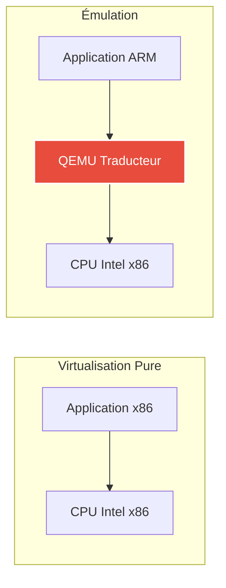

# L'Émulation (QEMU)

<div
  class="omny-meta"
  data-level="🔴 Avancé"
  data-version="1.0"
  data-time="20 - 30 minutes">
</div>


!!! quote "Analogie pédagogique"
    _La virtualisation s'apparente à la construction de plusieurs appartements (Machines Virtuelles) au sein d'un même grand immeuble (Serveur Hyperviseur physique). L'hyperviseur s'assure que chaque locataire reçoit son quota d'électricité et d'eau (CPU, RAM) sans jamais pouvoir entrer par effraction chez son voisin._

!!! quote "L'illusion absolue"
    _Une Machine Virtuelle classique (VMware/VirtualBox) s'attend à ce que le processeur virtuel soit de la même famille que le processeur physique (ex: x86_64 / Intel). Si vous essayez de faire tourner le système d'une console de jeu des années 90 ou le système d'un Raspberry Pi (qui utilise un processeur ARM) sur votre PC Intel, la virtualisation classique échouera. Il vous faut un **Émulateur**, capable de traduire le langage matériel à la volée._

## Virtualisation vs Émulation

Il est fondamental de comprendre la différence :

1. **Virtualisation** : Les instructions envoyées par le système invité sont **les mêmes** que celles comprises par le processeur physique. L'hyperviseur ne fait que les coordonner. (Très rapide).
2. **Émulation** : Le système invité envoie des instructions (ex: architecture ARM) que votre processeur physique (ex: Intel x86) ne comprend pas. Le logiciel d'émulation doit capter chaque instruction, la décoder, et la traduire en une instruction Intel équivalente. (Extrêmement lent).


```mermaid
graph LR
    subgraph Virtualisation Pure
        App1[Application x86] --> CPU1[CPU Intel x86]
    end
    
    subgraph Émulation
        App2[Application ARM] --> Traducteur[QEMU Traducteur] --> CPU2[CPU Intel x86]
    end
    
    style Traducteur fill:#e74c3c,stroke:#fff,stroke-width:2px,color:#fff
```

---

## Qu'est-ce que QEMU ?

**QEMU (Quick EMUlator)** est l'outil open source standard sous Linux pour faire de l'émulation matérielle.

Il est capable d'émuler des cartes mères entières, des cartes réseau, des disques durs IDE/SATA, et surtout de nombreuses architectures processeurs : x86, ARM, MIPS, PowerPC, SPARC.

### Exemple : Lancer une image ARM sur PC Intel
En cybersécurité (Reverse Engineering de firmware IoT par exemple), un analyste peut extraire le système de fichiers d'une caméra de surveillance (qui tourne sur un processeur ARM). 
Grâce à QEMU, il peut "allumer" ce système sur son propre ordinateur portable Intel pour l'analyser dynamiquement :

```bash
# Lancement d'un noyau ARM avec QEMU
qemu-system-arm -M versatilepb -m 256M -kernel zImage -drive file=rootfs.ext2,if=scsi -append "root=/dev/sda"
```

---

## Le duo QEMU / KVM

L'émulation pure de QEMU est magique, mais très lente. 

Cependant, QEMU est tellement bien conçu qu'il est aujourd'hui utilisé pour "dessiner" le faux matériel (la fausse carte mère, la fausse carte vidéo) des machines virtuelles modernes, tandis que le travail du processeur est géré à pleine vitesse par le module noyau **KVM** (qui fait de la virtualisation pure).

C'est pourquoi, dans les Data Centers Linux, vous entendez presque toujours le terme couplé : **QEMU-KVM**. QEMU gère les périphériques virtuels, KVM gère le processeur.

## Conclusion

QEMU est un couteau suisse technologique. Pour l'administration quotidienne de serveurs x86, il est utilisé conjointement avec KVM de manière invisible (vous ne tapez jamais de commande `qemu` directement). Mais pour l'analyste en sécurité, c'est l'outil qui permet de simuler le firmware d'un routeur compromis, l'OS d'un smartphone Android, ou le calculateur d'une voiture autonome.

<br>

---

## Conclusion

!!! quote "Ce qu'il faut retenir"
    La virtualisation (KVM, Proxmox) couplée à l'Infrastructure as Code (Packer, Vagrant) permet de déployer des environnements reproductibles, immuables et sécurisés dès leur conception (Security by Design).

> [Retourner à l'index →](../index.md)
