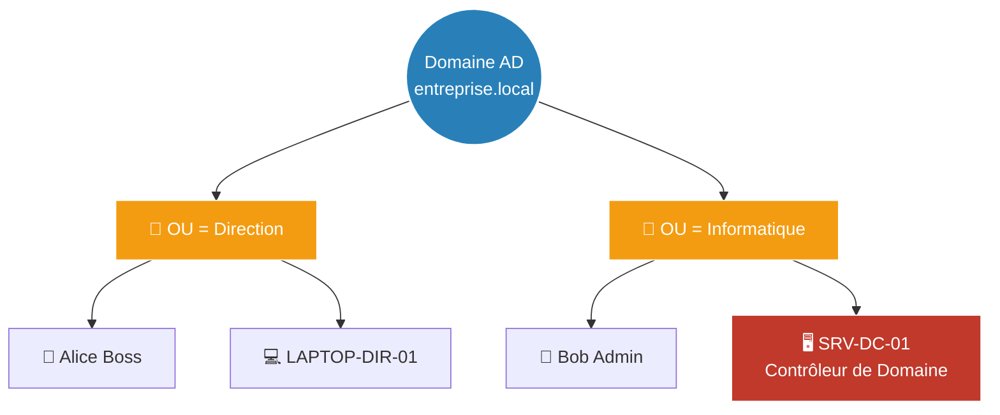

# L'Annuaire (AD & GPO)

!!! quote "Analogie pédagogique"
    _L'Active Directory (AD) est le cadastre de l'entreprise : il référence tous les employés et ordinateurs. Les GPO (Group Policy Objects) sont le règlement intérieur imposé par la direction : elles dictent magiquement ce que chaque employé a le droit de faire ou non sur sa machine, de manière centralisée._

!!! quote "Le Saint Graal de l'entreprise"
    _Imaginez une entreprise de 2000 salariés. Si vous deviez aller sur chacun des 2000 ordinateurs pour créer le compte de l'utilisateur, définir le fond d'écran de l'entreprise, et configurer les imprimantes, il vous faudrait une armée de techniciens. L'**Active Directory (AD)** résout ce problème en centralisant toute l'identité et les autorisations sur un serveur central (Le Contrôleur de Domaine)._

## 1. L'Active Directory (Concepts Clés)

L'Active Directory est un annuaire LDAP propriétaire de Microsoft. Il stocke des objets (Utilisateurs, Ordinateurs, Groupes) dans une base de données hiérarchique très structurée.

### Le Domaine
Un domaine est une frontière logique. Tous les PC joints au domaine `entreprise.local` font confiance au serveur maître (le **Contrôleur de Domaine** ou **DC**) pour l'authentification (via le protocole sécurisé Kerberos).

### L'Unité Organisationnelle (OU)
Pour éviter d'avoir 2000 utilisateurs en vrac, on les range dans des Unités Organisationnelles (Des "dossiers" logiques).

L'avantage majeur de l'OU n'est pas juste le tri visuel, c'est de pouvoir appliquer des règles de sécurité (GPO) différentes selon le dossier !

---

## 2. Les Stratégies de Groupe (GPO)

Les **Group Policy Objects (GPO)** sont la véritable "magie" de Windows en entreprise. Il s'agit d'un ensemble de milliers de paramètres système que le Contrôleur de Domaine va "pousser" de force sur les ordinateurs du réseau.

### Que peut-on faire avec une GPO ?
Littéralement tout.
- **Sécurité** : Forcer un mot de passe de 12 caractères qui change tous les 90 jours. Interdire l'accès à l'invite de commande. Bloquer l'insertion de clés USB.
- **Confort utilisateur** : Mapper automatiquement le lecteur réseau `Z:` partagé par le service. Installer des imprimantes réseau silencieusement.
- **Déploiement logiciel** : Installer Chrome ou Office automatiquement au démarrage du PC.

### Héritage et Blocage
Les GPO s'appliquent en cascade.
1. Une GPO appliquée au Domaine entier affecte tout le monde (ex: Règle des mots de passe).
2. Une GPO appliquée sur l'OU "Comptabilite" n'affectera que les comptables.
*(Les GPO plus spécifiques écrasent les GPO plus globales en cas de conflit).*

---

## 3. L'Administration au Quotidien (RSAT)

Un administrateur système ne se connecte **jamais** en Bureau à Distance (RDP) sur le Contrôleur de Domaine (DC) pour faire son travail. Le DC est critique, chaque connexion humaine est un risque.

L'administrateur travaille depuis son propre PC Windows 10/11, sur lequel il installe le **RSAT** (Remote Server Administration Tools). Il ouvre sa console "Utilisateurs et ordinateurs Active Directory" localement, mais elle est connectée à la base de données du DC.

### Les Groupes de Sécurité
Dans l'AD, on n'attribue jamais un droit (ex: "Accès au dossier Confidentiel") directement à l'utilisateur "Alice". On utilise la méthode **A-G-DL-P** :
1. **A**ccount (Le compte Alice)
2. Est membre du **G**lobal Group (Le groupe métier `G_Direction`)
3. Est membre du **D**omain **L**ocal group (Le groupe de ressource `DL_Dossier_Confidentiel_Lecture`)
4. Auquel on applique la **P**ermission (Le droit NTFS "Lecture" sur le dossier).

Ainsi, si un nouveau directeur arrive, il suffit de le mettre dans le groupe `G_Direction`, et il hérite automatiquement des centaines d'accès à travers l'entreprise.

## Conclusion et lien avec la Cyber

Pour un attaquant (Pentester ou Ransomware), le Contrôleur de Domaine (DC) est la cible ultime. S'il réussit à compromettre le compte d'un Administrateur du Domaine (Domain Admin), "la partie est finie" (Game Over). Il peut instantanément déployer un malware sur tous les PC de l'entreprise via GPO. C'est pourquoi la sécurité de l'Active Directory, et l'isolation des comptes à hauts privilèges (Méthode de l'Administration en Tiering) sont aujourd'hui au cœur des enjeux de cybersécurité moderne.

 

---

## Conclusion

!!! quote "Ce qu'il faut retenir"
    L'écosystème Windows et Active Directory est le cœur battant de la plupart des réseaux d'entreprise. Son durcissement rigoureux via les GPO et l'administration sécurisée via PowerShell sont critiques pour prévenir les mouvements latéraux.

> [Retourner à l'index →](../index.md)
