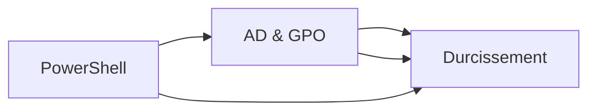

# Windows

## Introduction

!!! quote "Analogie pédagogique"
    _Windows Server, c'est comme diriger une entreprise hiérarchisée. PowerShell est la langue officielle pour automatiser. Active Directory, c'est l'organigramme vivant qui définit qui fait quoi. Le durcissement, c'est le règlement intérieur qui protège contre les dérapages et les intrusions._

Cette section "Windows" est construite comme un socle complet et pragmatique. L'objectif n'est pas de "cliquer dans des interfaces", mais de comprendre comment administrer via PowerShell, gérer un domaine Active Directory avec ses politiques (GPO), et sécuriser l'infrastructure selon les standards reconnus (CIS, STIG, ANSSI).

## Architecture du parcours

L'ordre n'est pas strict, mais en pratique : on maîtrise PowerShell, on administre AD/GPO, puis on durcit l'infrastructure.

---

## Vue d'ensemble

* :material-powershell:{ .lg .middle } **PowerShell**

    ---

    Shell moderne Windows, cmdlets, pipeline objets .NET, automation, remoting, DSC. Administration système via ligne de commande.

    **Objectif** : administrer Windows efficacement sans GUI.

    [:lucide-book-open-check: Accéder](./powershell.md)

* :lucide-building:{ .lg .middle } **Active Directory & GPO**

    ---

    Installation AD DS, gestion utilisateurs/groupes/OUs, Group Policy Objects, DNS/DHCP intégré, Kerberos/NTLM, réplication domaines.

    **Objectif** : administrer un domaine Windows centralisé.

    [:lucide-hourglass: Bientôt disponible](#)

* :lucide-shield-check:{ .lg .middle } **Durcissement**

    ---

    CIS Benchmarks, DISA STIG, hardening GPO, Windows Defender Advanced, AppLocker/WDAC, audit logging, Credential Guard.

    **Objectif** : sécuriser Windows Server production selon standards.

    [:lucide-hourglass: Bientôt disponible](#)

---

## Synthèse "logique métier" (ce que tu dois retenir)

Tu peux voir Windows comme un triangle opérationnel :

* PowerShell : automation, administration scriptée, efficacité.
* Active Directory & GPO : gestion centralisée identités, politiques, cohérence domaine.
* Durcissement : réduction surface attaque + compliance + audit continu.

Si une seule brique est faible, l'infrastructure devient vulnérable. La progression du guide suit donc une logique "production Microsoft".

 
