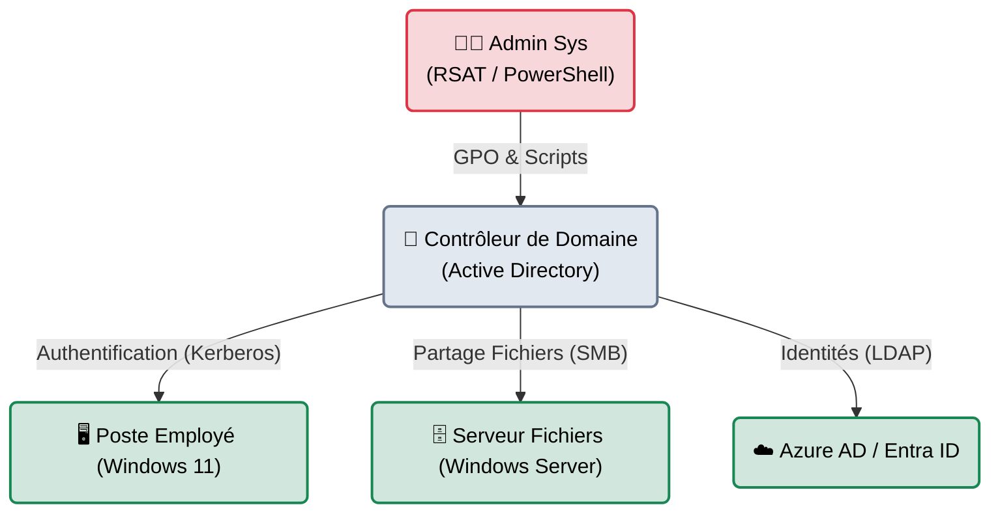

# Systèmes Windows Server

!!! quote "Analogie pédagogique"
    _L'Active Directory (AD) sous Windows est comme l'état civil central et le cadastre d'un pays. Au lieu de laisser chaque ville (ordinateur) gérer ses passeports et ses lois, l'AD centralise l'identité de tous les citoyens (utilisateurs) et impose des lois fédérales (GPO) applicables partout instantanément._

!!! quote "Le pilier de l'entreprise"
    _Si Linux est le roi incontesté de l'hébergement Cloud public et des serveurs web, **Windows Server** règne en maître absolu sur l'infrastructure interne des entreprises de taille moyenne et grande. Gérer un parc de 500 ordinateurs employés, centraliser leurs mots de passe, et déployer des règles de sécurité globables est un cauchemar sous Linux. Sous Windows, grâce à l'Active Directory, c'est natif._

## Organisation de la section

Contrairement au développement logiciel, l'administration d'un parc Windows d'entreprise demande une grande rigueur, une compréhension de la philosophie Microsoft (très orientée "Objet" même dans son Shell) et une maîtrise des politiques de groupe.

```mermaid
flowchart TD
    %% Couleurs
    classDef ad fill:#e2e8f0,stroke:#64748b,stroke-width:2px,color:#000
    classDef target fill:#d1e7dd,stroke:#198754,stroke-width:2px,color:#000
    classDef admin fill:#f8d7da,stroke:#dc3545,stroke-width:2px,color:#000

    A("👨‍💻 Admin Sys<br>(RSAT / PowerShell)") -->|"GPO & Scripts"| B("🏢 Contrôleur de Domaine<br>(Active Directory)")
    
    B -->|"Authentification (Kerberos)"| C("🖥️ Poste Employé (Windows 11)")
    B -->|"Partage Fichiers (SMB)"| D("🗄️ Serveur Fichiers (Windows Server)")
    B -->|"Identités (LDAP)"| E("☁️ Azure AD / Entra ID")

    class B ad
    class C,D,E target
    class A admin
```

 

---

## 🧭 Navigation du Module

-   :lucide-terminal-square:{ .lg .middle } **Automatisation (PowerShell)**

    ---
    Oubliez l'invite de commande DOS obsolète (cmd). Découvrez le Shell moderne, surpuissant et orienté objet de Microsoft pour automatiser l'administration.

    [:octicons-arrow-right-24: Maîtriser PowerShell](./powershell.md)

-   :lucide-network:{ .lg .middle } **L'Annuaire (AD & GPO)**

    ---
    Le cœur nucléaire du réseau d'entreprise. Gérer de manière centralisée des milliers d'utilisateurs, d'ordinateurs et appliquer des stratégies globales (GPO).

    [:octicons-arrow-right-24: Explorer l'Active Directory](./ad-gpo.md)

-   :lucide-shield-half:{ .lg .middle } **Sécurisation (Hardening)**

    ---
    Un serveur Windows non durci est la cible favorite des ransomwares. Apprenez les meilleures pratiques pour verrouiller un contrôleur de domaine et limiter la surface d'attaque.

    [:octicons-arrow-right-24: Durcir Windows Server](./hardening.md)

 

---

## Conclusion

!!! quote "Ce qu'il faut retenir"
    Il est tentant d'administrer Windows Server uniquement à la souris (via le Server Manager). **C'est une très mauvaise habitude.** Microsoft pousse depuis plus de 10 ans l'installation de "Windows Server Core" (sans interface graphique) pour des raisons de sécurité. L'administrateur moderne doit être capable de gérer un domaine entier via la ligne de commande.

> Prêt à quitter la souris ? Plongez dans l'outil d'administration le plus puissant de Microsoft : **[PowerShell](./powershell.md)**.
